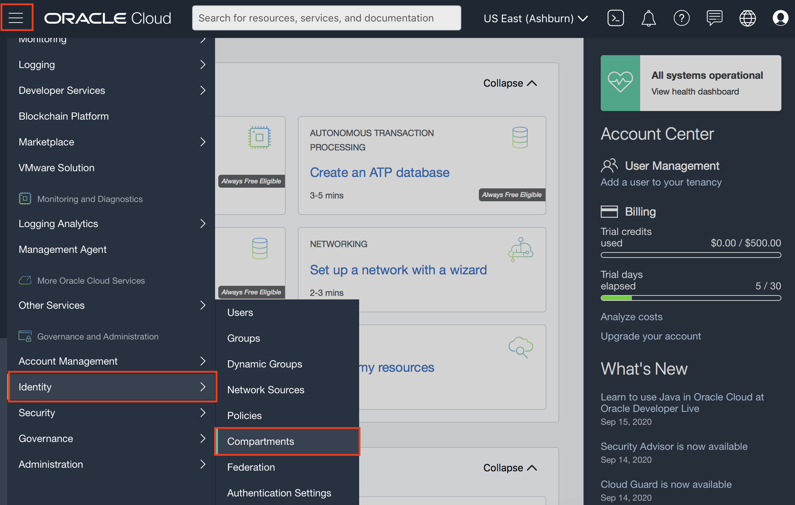
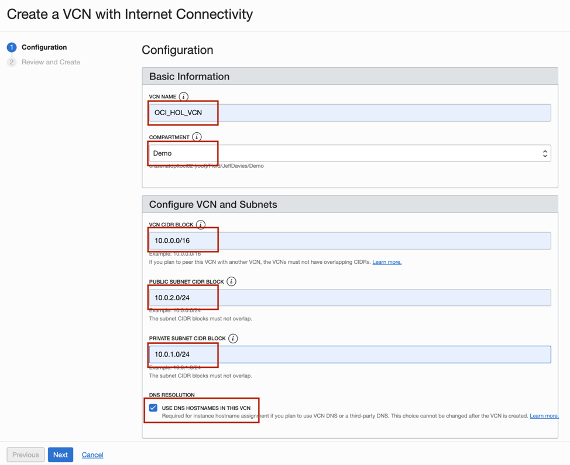

# Lab 200 : Create Identity and Access Management (IAM) Resources.

## Introduction

Oracle Cloud Infrastructure Identity and Access Management (IAM) Service lets you control who has access to your cloud resources. You control the types of access a group of users has and to which specific resources. The purpose of this lab is to give you an overview of the IAM Service components and an example scenario to help you understand how they work together.

## Prerequisites

1.	Oracle Cloud Infrastructure account credentials (User, Password, and Tenant)

2. 	To sign in to the Console, you need the following: 

        1. Tenant, User name and Password
        2. URL for the Console: https://oracle.com
        3. Oracle Cloud Infrastructure supports the latest versions of Google Chrome, Firefox and Internet Explorer 11

## **Step 1:** Signing in to the Console

Console Overview
In this, you sign in to the Oracle Cloud Infrastructure console using your credentials.

1.	Open a supported browser and go to the Console URL: https://oracle.com.

2.	Click on the portrait icon in the top-right section of the browser window, then click on the Sign in to Cloud link.


3.	Enter the name of your tenancy (aka your account name, not your user name), then click on the Next button.


4.	Oracle Cloud Infrastructure is integrated with Identity Cloud Services, you will see a screen validating your Identity Provider. Enter your username and password. Click Sign In.


5.	When you sign in to the Console, the dashboard is displayed.


## **Step 2:** Creating Compartments

**Compartments Overview:**

A compartment is a collection of cloud assets, like compute instances, load balancers, databases, etc. By default, a root compartment was created for you when you created your tenancy (ie when you registered for the trial account). It is possible to create everything in the root compartment, but Oracle recommends that you create sub-compartments to help manage your resources more efficiently.

1.	Click on three-line menu which is on the top left of the console. Scroll down till the bottom of the menu, click on **Identity -> Compartments**. Click on the blue **Create Compartment** button to create a sub-compartment.




2.	Name the compartment **Demo** and provide a short description. Be sure your root compartment is shown as the parent compartment. Press the blue **Create Compartment button** when ready.


3.	You have just created a compartment for all of your work in this Test Drive.

## **Step 3:** Managing Users, Groups and Policies to Control Access

**Security Overview:** 

A user's permissions to access services comes from the groups to which they belong. The permissions for a group are defined by policies. Policies define what actions members of a group can perform, and in which compartments. Users can access services and perform operations based on the policies set for the groups of which they are members.

We'll create a user, a group, and a security policy to understand the concept.

1.	After signing in to the console, click on the three-line menu on the top left. Click on **Identity -> Groups**.


2.	Click **Create Group**.

3.	In the Create Group dialog box, enter the following:

        1. Name: Enter a unique name for your group such as "oci-group” Note that the group name cannot contain spaces.

        2. Description: Enter a description (for example, “New group for oci users”).

        3. Click Submit.


4.	Your new group is displayed.


5.	Now, let’s create a security policy that gives your group permissions in your assigned compartment. In this case, we will create a policy that gives permission to users belonging to group oci-group to provision Peoplesoft Cloud Manager in Compartment Demo:

    a) Click on the three-line Menu button on the top left. Click on **Identity -> Policies**.

        

    b) On the left side, navigate to **COMPARTMENT** and select **root compartment**. 

    

    c) After you have selected the root compartment, click **Create Policy**.

    d) Enter a unique Name for your policy (For example, "Policy-for-oci-group") Note that the **name can NOT contain spaces**.

    e) Enter a Description (for example, "Policy for OCI Group").

    f) Enter the following Statement:
    
    ```
    Allow group oci-group to manage all-resources in compartment Demo
    Allow group oci-group to read all-resources in tenancy
    Allow group oci-group to manage App-catalog-listing in tenancy
    ```  

    g) Click **Create**.

        


6. Create a **New User**
   
    a) Click on three-line menu on top left, and click on **Identity -> Users**.

    b) Click **Create User**.

    c) In the New User dialog box, enter the following:

        Name: Enter a unique name. This user should have a unique name in the tenancy.

        Description: Enter a description. For example, New oci user.

        Email: Enter your email ID and verify it. 

    

    d) Click **Create**.


7.	Set a **Temporary Password** for the newly created User

    a) After the user is created, you can see the user details.

    b) Click **Create/Reset Password**.

    

    c) In the dialog, click **Create/Reset Password**.

    

    d) The new one-time password is displayed. Click the **Copy button** and then click Close. Make sure to copy this password to your notepad.

    

    e) Scroll down and click on **Add User to Group**.

    

    f) Select the group you just created, and click on **Add**.

    

    g) Click on **top right icon button** and **Sign out** of the admin user account.

    


This time, you will sign in using local credentials box with the user you created. Note that the user you created is not part of the Identity Cloud Services.

    d) Enter the username **User01** and password that you copied.

    

    ```
    Note: Since this is the first-time sign-in, the user will be prompted to change the temporary password, as shown in the screen capture.
    ```

    e) Set the new password to Psft@1234. Click Save New Password. 

    

    You are now logged in as local user: User01

## **Step 4:** Creating a VCN

1.	On the Oracle Cloud Infrastructure Console Home page, under the Quick Actions header, click on Set up a network with a wizard.


2.	Select VCN with Internet Connectivity, and then click Start Workflow.


3.	Complete the following fields:

Field |	Vaue
----- | ----
VCN NAME |	OCI_HOL_VCN
COMPARTMENT	| Choose the Demo compartment you created in the Identity Lab
VCN CIDR BLOCK |	10.0.0.0/16
PUBLIC SUNBET CIDR BLOCK |	10.0.2.0/24
PRIVATE SUBNET CIDR BLOCK |	10.0.1.0/24
USE DNS HOSTNAMES IN THIS VCN |	Checked

4.	Your screen should look similar to the following:



5.	Press the Next button at the bottom of the screen.

6.	Review your settings to be sure they are correct. 


7.	Press the Create button to create the VCN. I will take a moment to create the VCN and a progress screen will keep you apprised of the workflow.


8.	Once you see that the creation is complete (see previous screenshot), click on the View Virtual Cloud Network button.

### Summary
This VCN will contain all of the other assets that you will create during this set of labs. In real-world situations, you would create multiple VCNs based on their need for access (which ports to open) and who can access them


## **Step 5:** Creating a new subnet

1.	Navigate to Menu -> Networking -> Virtual Cloud Networks.  Set the Compartment to ‘PSFT_Lab’.  Click on the existing VCN "OCI_HOL_VCN". 


2.	Click on Create Subnet button to add a new subnet. Use default route table, and default DHCP options. Use 10.0.8.0/24 as the CIDR for subnet. 


Attribute | Value
--------- | -----
Name|	MySubnet
Subnet Type	| Availability Domain-specific
Availability Domain	| AD 3
CIDR Block| 	10.0.8.0/24
Route Table	 | Default Route Table for labnet
Subnet Access| 	Public Subnet
DNS Resolution|	Enable Use DNS hostnames in this SUBNET
Security List	|Add two security lists using the button + Additional Security List as shown in below screenshot - 1. cm_sec 2. Default Security List for labnet


3.	Click Create Subnet.  The newly created subnet will be as shown 


## **Step 6:** Create Windows Instance

In this lab exercise, Windows node was removed from the topology to keep the provisioning process short and simple.  If you want to provision Windows instances as part of an environment at a later point in time, you can do so easily. 


