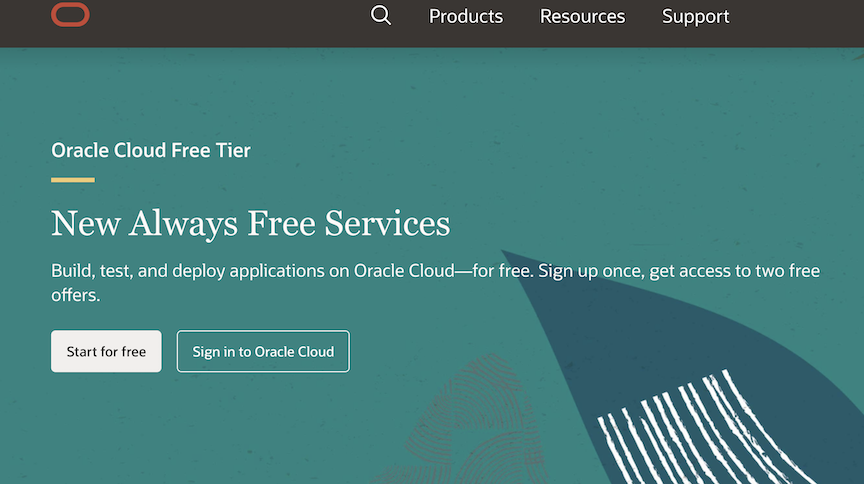
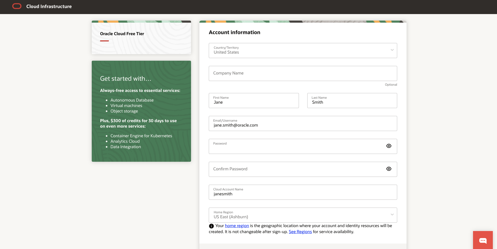
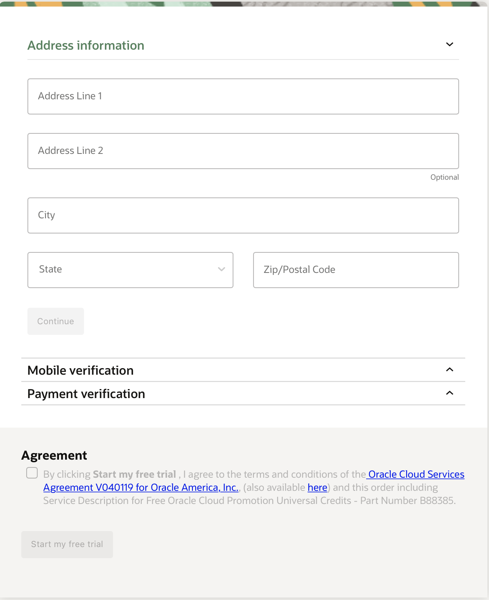

# Lab 100 : Setting up Oracle Cloud Infrastructure.  

## Introduction
This lab will guide you through creating your own OCI environment.

## Part 1. Sign Up for a Trial Account

1. From your laptop, go to [oracle.com/cloud/free](oracle.com/cloud/free) and click "Start for free".



2. On the Oracle Cloud Sign Up page, enter the requested information, including your Cloud account name (Tenancy name) and password.

```
Note: Ensure that you use the same email address used when you registered.
```


3. Fill all the information. Accept the Agreement and click on **Start my free trial.**



4. You should shortly get an email with the login details.


