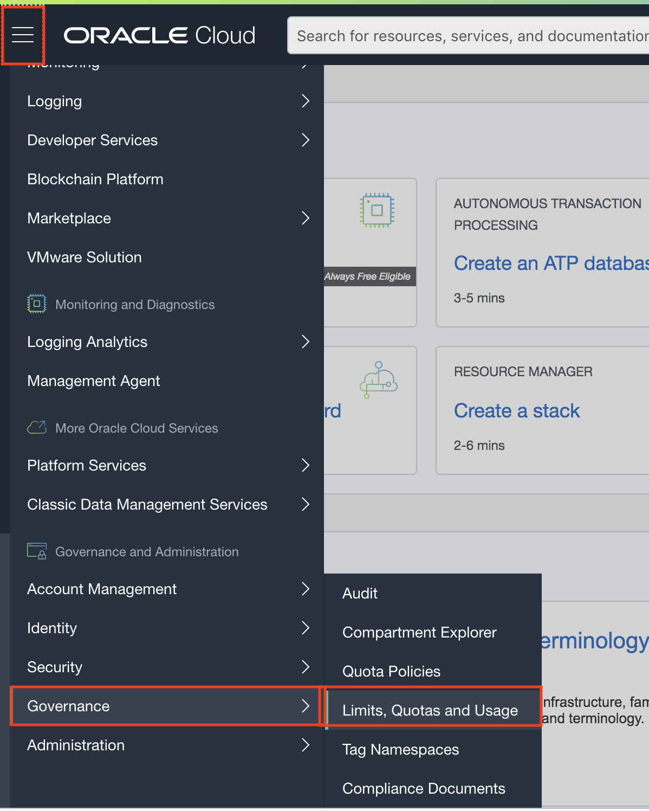
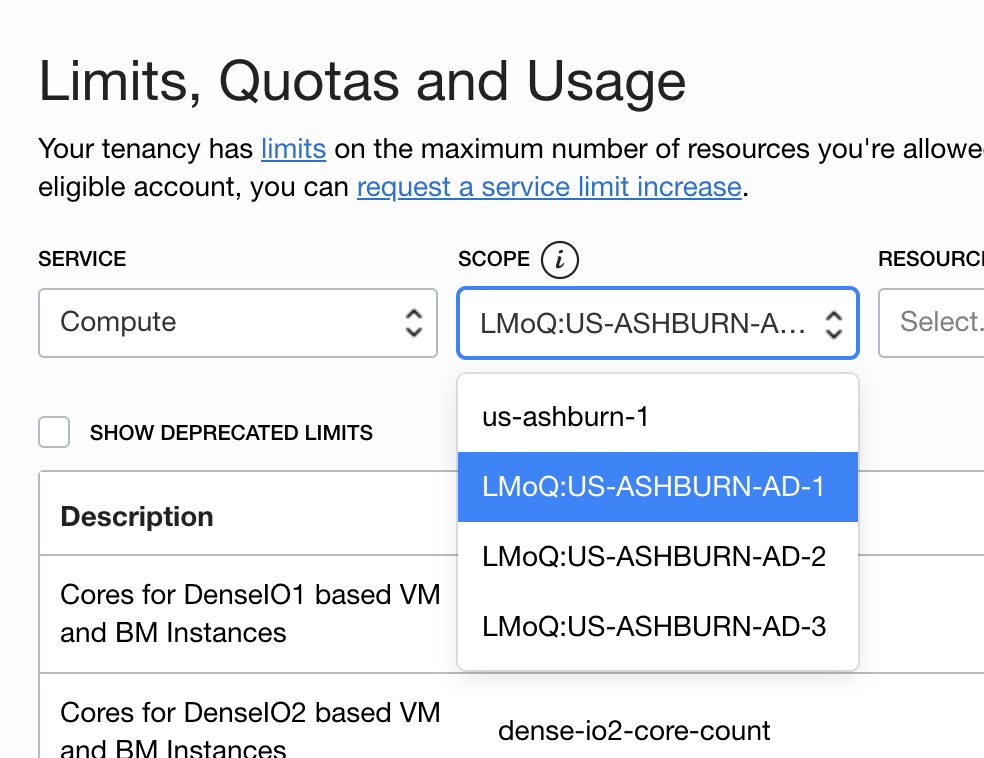

# Lab 100 : Preparing OCI tenancy 

## Introduction
This lab will guide you to create your own OCI environment and look for the resources required

## Part 1. Sign Up for a Trial Account

1. From your laptop, go to (oracle.com/cloud/free)[oracle.com/cloud/free] and click “Start for free”.


2. On the Oracle Cloud Sign Up page, enter the requested information including your desired tenancy name and tenancy password.

```
Note: Ensure that you use the same email address used when you registered.
```

3. The OCI Console URL will be as shown in the screenshot below.  
The standard format is – https://myservices-<account_name>.console.oraclecloud.com. In this example, the account name provided during account creation is ‘nkpsftcloud’.  The URL will be: https://myservices-nkpsftcloud.console.oraclecloud.com. 


3. Review your details and click **Submit**.

4. You should shortly get an email with login details.

## Part 2. View Service Limit.

During the workshop, you might face problems related to service limit. 
Please check if you have enough availability of resource in your Availability Domain or else change the Availability Domain to 1/2/3 as per the availbility. 

1. To check the service limit, navigate to the three-line menu on the top left and click on Governance -> Limits, Quotas and Usage.



2. Click on **Scope** and select AD-1 or AD-2 or AD-3 depending on which availability domain you want to see the service limit. 



3. Scroll down the list and you will see all the resources availabile and usage. For ex, in below case, all my available resources are used.


