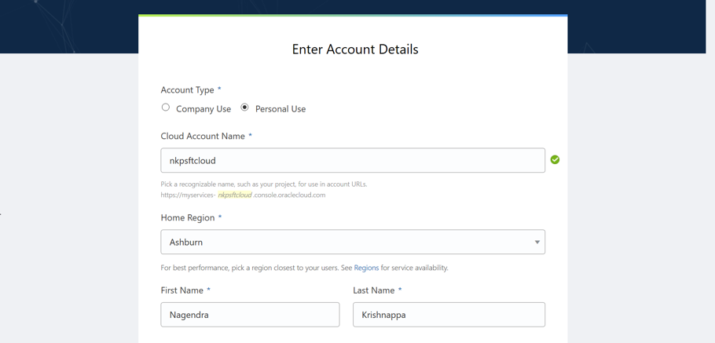

# Lab 100 : Preparing OCI tenancy 

## Introduction
This lab will guide you to create your own OCI environment and look for the resources required

## Part 1. Sign Up for a Trial Account

1. From your laptop, go to (oracle.com/cloud/free)[oracle.com/cloud/free] and click “Start for free”.


2. On the Oracle Cloud Sign Up page, enter the requested information including your desired tenancy name and tenancy password.

```
Note: Ensure that you use the same email address used when you registered.
```

3. The OCI Console URL will be as shown in the screenshot below.  
The standard format is – https://myservices-<account_name>.console.oraclecloud.com. In this example, the account name provided during account creation is ‘nkpsftcloud’.  The URL will be: https://myservices-nkpsftcloud.console.oraclecloud.com. 



3. Review your details and click **Submit**.


