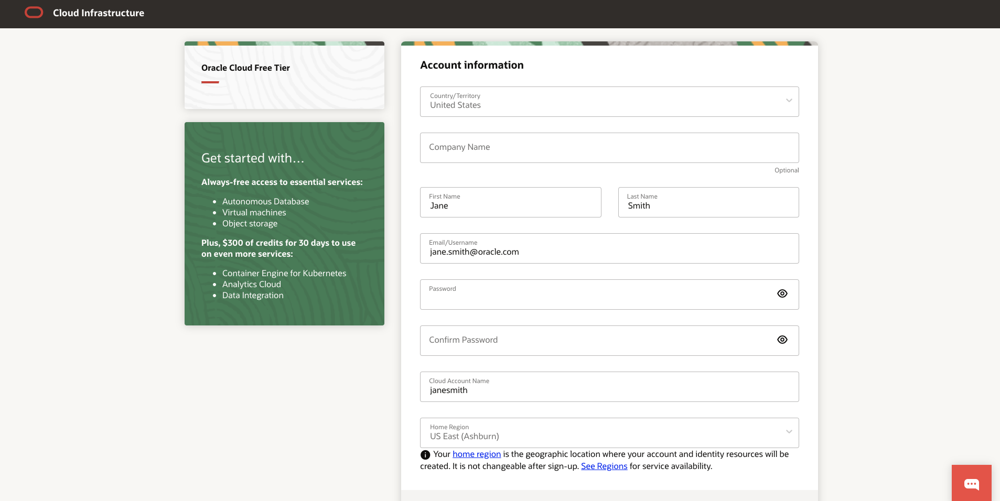

# Lab 1 : Setting up Oracle Cloud Infrastructure.  

## Introduction

This lab will guide you through creating your own OCI environment.

**Estimated Lab Time** : 10 mins 

### Objectives

- Sign Up for a Trial Account  

### Prerequisites

- A valid email address
- Ability to receive SMS text verification (only if your email isn't recognized)

## **Step 1 : Sign Up for a Trial Account**

If you already have a cloud account, skip to Lab 2.

1. From your laptop, go to [oracle.com/cloud/free](oracle.com/cloud/free) and click "Start for free".


2. On the Oracle Cloud Sign Up page, enter the requested information, including your Cloud account name (This is your Tenancy name - assign a unique tenancy name to login to) and password.

```
Note: Ensure that you use the same email address used when you registered.
```


3. Make sure your pop-up for the browser is enabled. Once the pop-up screen appears, make sure you select the offer by clicking on the circle.


4. Fill all the information. Please give the home region as **us-ashburn-1**. Accept the Agreement and click on **Start my free trial.**


5. You should shortly get an email with the login details.

You may now proceed to the next lab.

## Acknowledgements

**Created By/Date**   
- Rich Konopka, Peoplesoft Specialist, October 2020  
- Megha Gajbhiye, Cloud Solutions Engineer, October 2020  

**Last Updated By/Date**    
- Sara Lipowsky, Cloud Solutions Engineer, October 2020  

## See an issue?

Please submit feedback using this [form](https://apexapps.oracle.com/pls/apex/f?p=133:1:::::P1_FEEDBACK:1). Please include the **workshop name**, **lab** and **step** in your request. If you don't see the workshop name listed, please enter it manually. If you would like for us to follow up with you, enter your email in the **Feedback Comments** section.