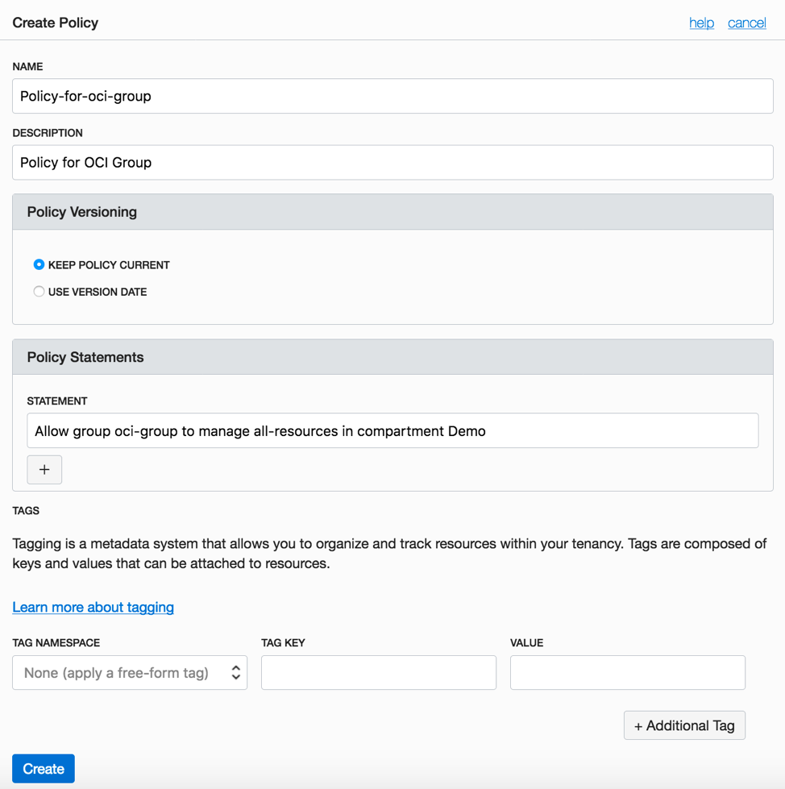

# Lab 300 : Provisioning Cloud Manager from Resource Manager.

## Introduction
Resource Manager is an Oracle Cloud Infrastructure service that helps you install, configure, and manage resources. Resource Manager uses Terraform (which is part of the service) to codify your infrastructure in declarative configuration files, which allows you to review and edit, version, persist, reuse, and share them across teams. You can then use Resource Manager to provision Oracle Cloud Infrastructure resources using your Terraform configurations.

In this tutorial, you obtain the configuration files, or stack, for Cloud Manager from the Oracle Cloud Infrastructure Marketplace, and use Resource Manager to create an instance and link it with associated resources such as a Virtual Cloud Network (VCN), subnet, gateways, and route tables. You enter the necessary passwords and other information in the Resource Manager interface, and choose the types of resources created.
Time: 80 min

## Part 1. Generating Keys

1. Ensure Git Bash is installed on your laptop/workstation.

2. Download the following script - [make_keys.sh](make_keys.sh)

3. Launch Terminal for Mac or Git Bash for Windows command line and navigate to the folder where the file was downloaded.

4. Give permission to the file by typing in command line: **chmod 777 make_keys.sh**

6. For Windows, run the script as **bash make_keys.sh**

For Mac terminal run the command - **./make_keys.sh**


7. Below set of key files are generated.  There are two sets of keys:

	I.	API Signing keys – api\_key and api\_key.pub

	II.	SSH key pair – id\_rsa and id\_rsa.pub

```
Note: These Keys are necessary for you to be able to securely connect into your PeopleSoft Cloud Tenancy.
```


## Part 2. Setting API keys for User01

1. In a browser, launch the OCI console. Login as User01. After you are succesfully logged in, click on the **profle button on top right**. Click on your user name - User01.
   (Refer to Lab 200 for details on how to login as User01.)


2. Scroll to the bottom, on the left side click on **API Keys** and then click on **Add Public Key**


3. Click on **Paste public keys** and Copy paste the content of **api_key.pub**. Click on **Add**.  


## Part 3. Gather Information for the Cloud Manager Stack

1. From the same User detail page, copy the OCID by clicking on **copy**. Paste it in a notepad, you will need it later.

2. On the top right, click on the region. Note the home region displayed. 


## Part 4. Obtain the PeopleSoft Cloud Manager Stack from the Marketplace

To obtain the PeopleSoft Cloud Manager stack:

1. On the Oracle Cloud Infrastructure console home page, click the top left three-line menu icon and select Marketplace -> Applications.


Below table summarizes the inputs in Configure Variables page.  

Attribute | Value
--------- | -----
AVAILABILITY DOMAIN | Availability Domain for CM instance and for provisioning PSFT environment
PRIVATE\_KEY\_PASSWD	| -
SHAPE | VM.Standard2.1(Modify in case your tenancy does not have this shape)
DB CONNECT PASSWORD	| peop1e
ACCESS PASSWORD | SYSAD123
DB ADMIN PASSWORD | Passw0rd#
CLOUD MANAGER ADMINISTRATOR PASSWORD | Passw0rd
INTEGRATION GATEWAY USER PASSWORD | Passw0rd
WEBLOGIC ADMINISTRATOR USER PASSWORD | Passw0rd
WEB PROFILE USER PASSWORD | PTWEBSERVER
DOMAIN CONNECT PASSWORD | Passw0rd123

4. Click Next and review your inputs.  



5.	Click Create. This will add a new stack and open the stack details page. 

6.	On the stack details page, under “Terraform Actions”, click Plan.


7.	After the Plan completes successfully, run Terraform Apply.


8.	Terraform Apply job is a long running process.  After it completes, the output from this job will have the IP address and PIA URL of CM instance.  To obtain those details, click on the Job name. 


9.	On the job details page, click on Output link under Resources. 


10.	Make a note of the Windows\_2016\_Platform\_Image\_for\_CM value. This OCID will be required in the next section. 

11.	Make a note of CM\_public\_ip and CM\_http\_url.

12.	Add an entry to C:\Windows\System32\drivers\etc\hosts entry on your laptop/workstation as shown below. Use the hostname value for attribute CM\_http\_url. 

	I.	Open Windows Search “Notepad”. Right Click on Notepad and open as Administrator.

	

	II.	Go to File -> Open -> C:\Windows\System32\drivers\etc\hosts, and append below entry

	```
	129.213.145.213  labcm.cm.labnet.oraclevcn.com
	```

## Part 3. Accessing Cloud Manager using SSH

1.	SSH key pair required to access Cloud Manager instance was created in step 6 in Part 1 of Lab 200. 

2.	The SSH key pair will be under the folder named ‘keys’, in the same folder where the psftcm-setup.zip was extracted. 


3.	Launch Git Bash and navigate to the keys folder. 

4.	Retrieve the Cloud Manager IP address.  It was provided as output when the stack was applied.


5.	SSH into the Cloud Manager instance using below command. 

```
$ ssh -i id_rsa opc@129.213.145.213 //Use your IP
```

## Part 4. Monitoring Cloud Manager

1. SSH into Cloud Manager instance to check status of deployment.  Monitor Cloud Manager bootstrap installation using below command.

```
$ tail -f /home/opc/bootstrap/CloudManagerStatus.log
```


2. While Cloud Manager is being installed, review Associated Resources for the list of all resources created by automation.

The deployment automation (Resource Manager Stack) provisions numerous resources in the tenancy.  To find the list of resources that were created, navigate to OCI console -> Resource Manager -> Stacks -> <Stack> -> Apply Job details.  On this page, click Associated Resources under Resources.  


In this lab example, the Associated Resources show all the newly created resources. 


3. After Cloud Manager bootstrap is complete, the CloudManagerStatus.log will show the following messages. 

		The PeopleSoft Environment Setup Process Ended.
		CM installed successfully
		Cloud Manager PIA URL: http://labcm.cm.labnet.oraclevcn.com:8000 
		Cloud Manager PIA SSL URL: https://labcm.cm.labnet.oraclevcn.com:8443

## Part 5. Access Cloud Manager

1. Launch a browser to access your Cloud Manager PIA URL (CM\_http\_url) –  http://labcm.cm.labnet.oraclevcn.com:8000

2. To login, use the username CLADM and password that was provided for input parameter OPR_PWD. 


