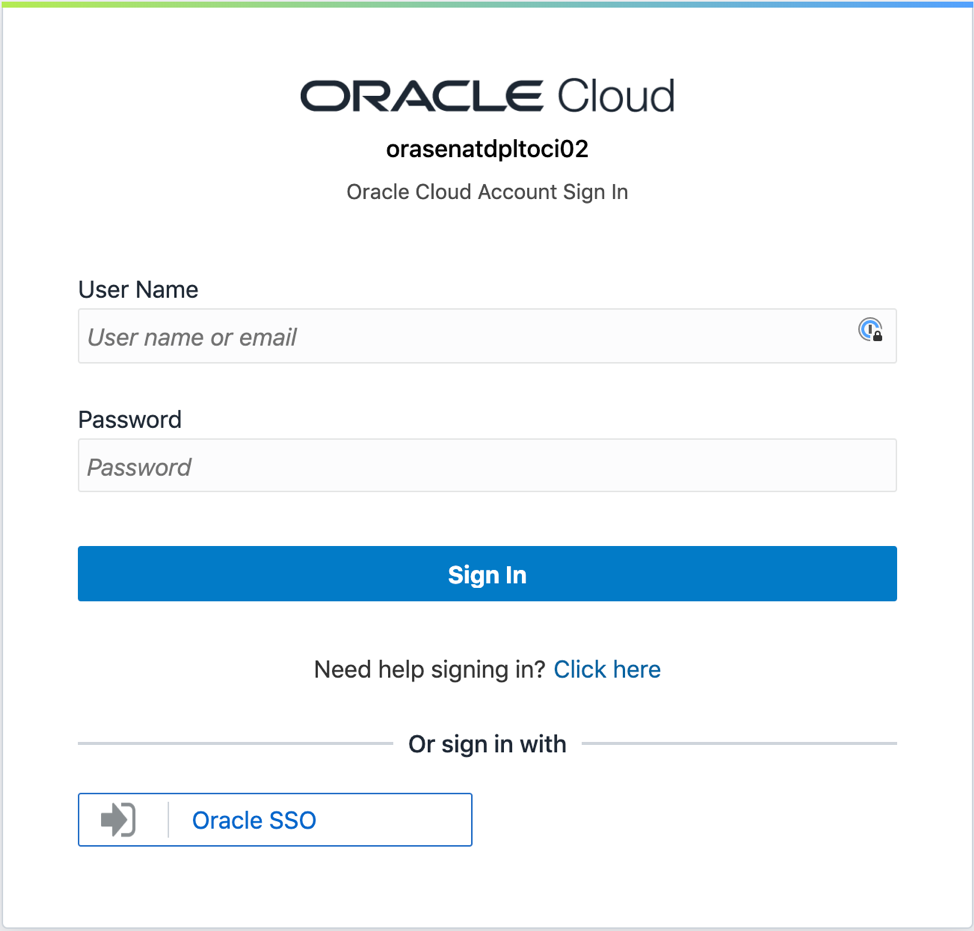
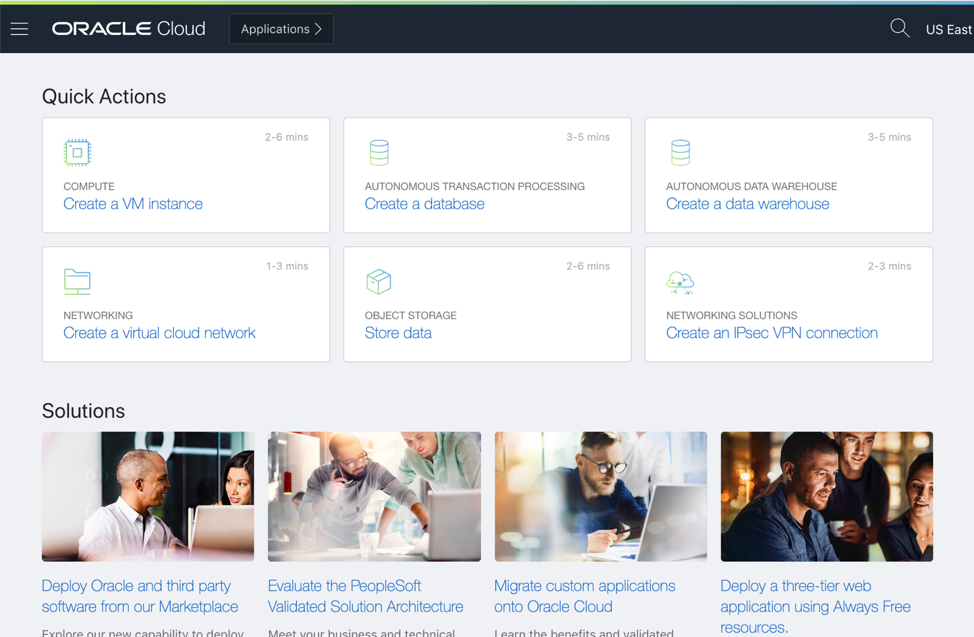
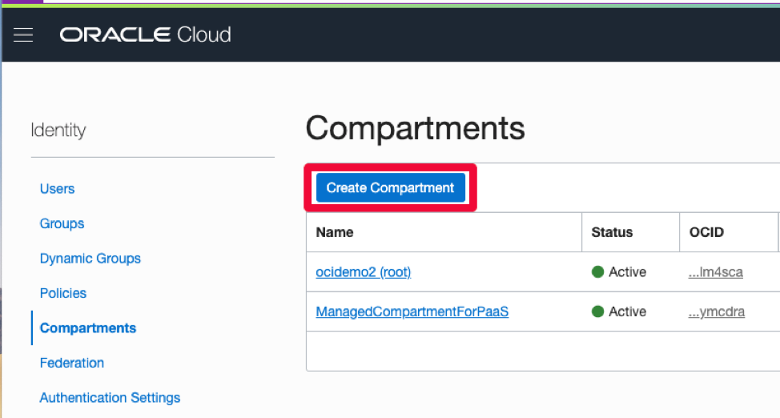
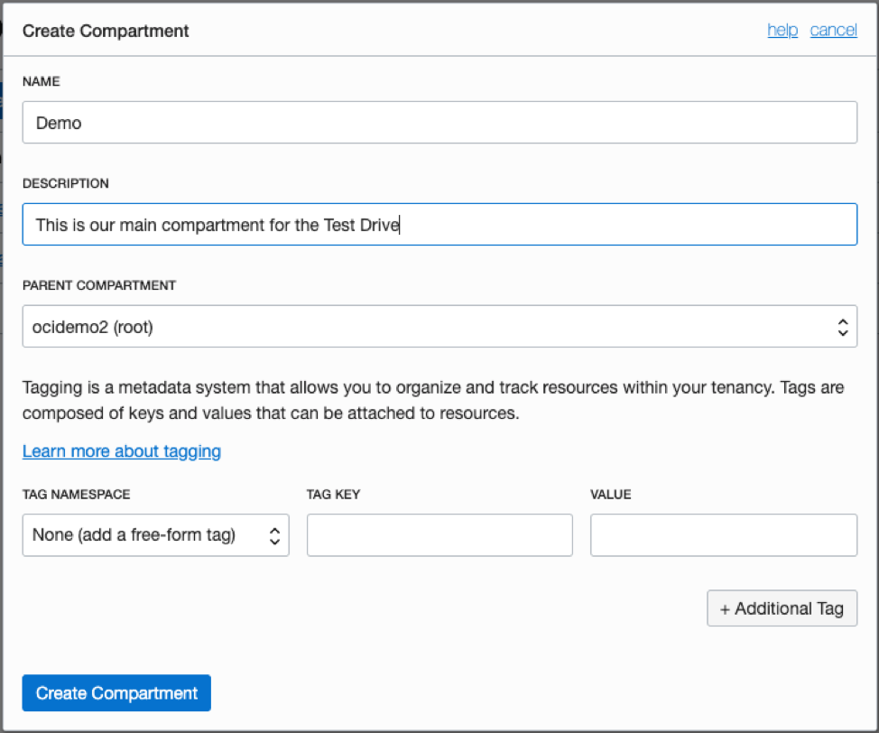
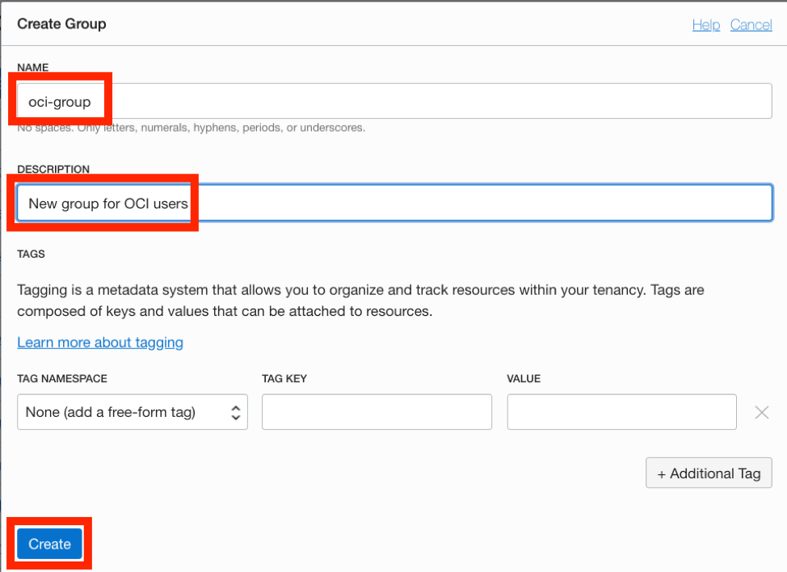
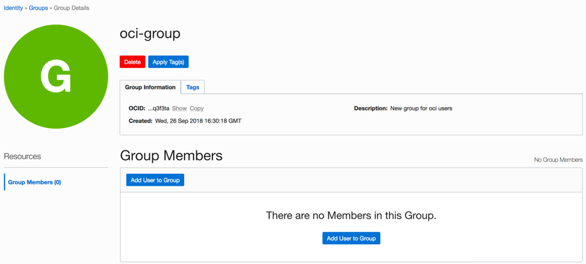
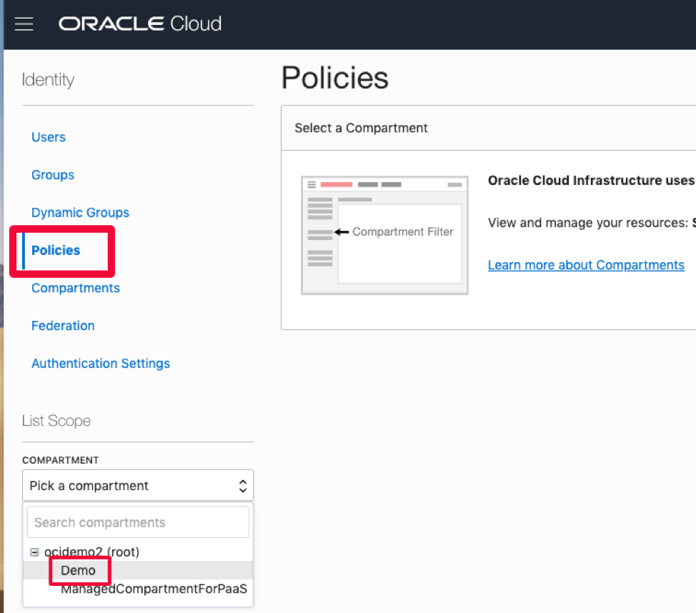
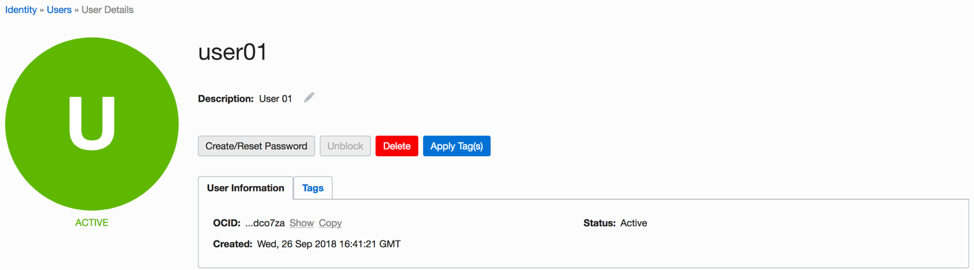
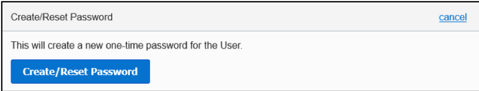
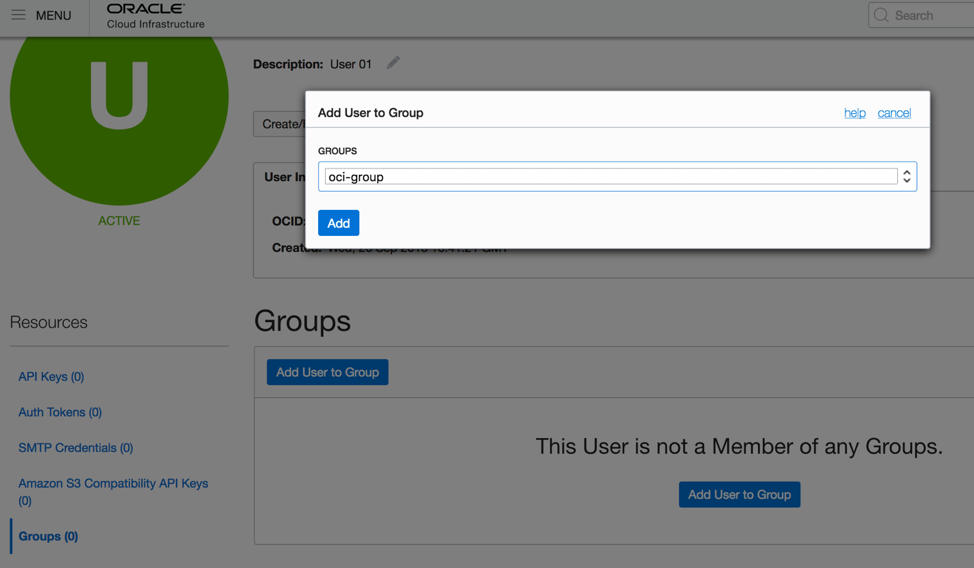

# Lab 200 : Setting up Cloud Manager

## Introduction
This lab will guide you how to set up the Cloud Manager on your OCI tenancy

Time: 80 min

## Part 1. PeopleSoft setup

1. Ensure Git Bash is installed on your laptop/workstation. - Test

2. Download automation scripts bundle ‘psftcm-setup-3.0.zip’ - <a href="http://bit.ly/PSFTCM30">DOWNLOAD</a>

3. Extract psftcm-setup-3.0.zip to a new folder on the laptop/workstation. Let’s call it ‘psftcm setup-3.0’. 

Below are the contents in the zip file. 


4. Launch Git Bash for Windows command line and navigate to the newly extracted folder – ‘psftcm setup-3.0’.

In case of Mac, open terminal, navigate to the folder - 'psftcm setup-3.0'

5. Change directory to “keys” folder, under the extracted folder



6. Run the script “bash make_keys.sh”

For Mac terminal run the command - "./make_keys.sh"



7. Below set of key files are generated.  There are two sets of keys:

	I.	API Signing keys – api\_key and api\_key.pub

	II.	SSH key pair – id\_rsa and id\_rsa.pub

```
Note: These Keys are necessary for you to be able to securely connect into your PeopleSoft Cloud Tenancy.
```


8. Zip the contents in the extracted folder into a new zip file.  Let’s call it ‘psftcm-setup.zip’.  Note – The zip file should be created as shown below.  

Select all files -> right-click -> Send to -> Compressed folder.  
Rename the zip file. 





## Part 2. Shift into OCI

1. In a browser, launch the OCI console and navigate to Resource Manager -> Stacks.  
Refer Lab 100 for details on how to get OCI console URL. 


2. Add a new stack by uploading the newly created psftcm-setup.zip file.  



3. Click Next.  

You have to select an Availability Domain.  For the other variables, the default values should work in most cases.  Configure variables only if required.  If your tenancy has a different set of shapes, or they are allocated across different ADs, only then update the values. Otherwise, the defaults should work.



Below table summarizes the inputs in Configure Variables page.  

```
Please Note: If these values are not prefilled then you have not zipped up your psft_cm.zip file correctly as described in Step 8. 
Please make sure you create the zip file within the directory you are zipping up.
```

Attribute | Value
--------- | -----
AVAILABILITY DOMAIN | Availability Domain for CM instance and for provisioning PSFT environment
PRIVATE\_KEY\_PASSWD	| -
SHAPE | VM.Standard2.1(Modify in case your tenancy does not have this shape)
DB CONNECT PASSWORD	| peop1e
ACCESS PASSWORD | SYSAD123
DB ADMIN PASSWORD | Passw0rd#
CLOUD MANAGER ADMINISTRATOR PASSWORD | Passw0rd
INTEGRATION GATEWAY USER PASSWORD | Passw0rd
WEBLOGIC ADMINISTRATOR USER PASSWORD | Passw0rd
WEB PROFILE USER PASSWORD | PTWEBSERVER
DOMAIN CONNECT PASSWORD | Passw0rd123

4. Click Next and review your inputs.  


5.	Click Create. This will add a new stack and open the stack details page. 

6.	On the stack details page, under “Terraform Actions”, click Plan.


7.	After the Plan completes successfully, run Terraform Apply.


8.	Terraform Apply job is a long running process.  After it completes, the output from this job will have the IP address and PIA URL of CM instance.  To obtain those details, click on the Job name. 



9.	On the job details page, click on Output link under Resources. 



10.	Make a note of the Windows\_2016\_Platform\_Image\_for\_CM value. This OCID will be required in the next section. 

11.	Make a note of CM\_public\_ip and CM\_http\_url.

12.	Add an entry to C:\Windows\System32\drivers\etc\hosts entry on your laptop/workstation as shown below. Use the hostname value for attribute CM\_http\_url. 

	I.	Open Windows Search “Notepad”. Right Click on Notepad and open as Administrator.

	

	II.	Go to File -> Open -> C:\Windows\System32\drivers\etc\hosts, and append below entry

	```
	129.213.145.213  labcm.cm.labnet.oraclevcn.com
	```

## Part 3. Accessing Cloud Manager using SSH

1.	SSH key pair required to access Cloud Manager instance was created in step 6 in Part 1 of Lab 200. 

2.	The SSH key pair will be under the folder named ‘keys’, in the same folder where the psftcm-setup.zip was extracted. 


3.	Launch Git Bash and navigate to the keys folder. 

4.	Retrieve the Cloud Manager IP address.  It was provided as output when the stack was applied.


5.	SSH into the Cloud Manager instance using below command. 

```
$ ssh -i id_rsa opc@129.213.145.213 //Use your IP
```

## Part 4. Monitoring Cloud Manager

1. SSH into Cloud Manager instance to check status of deployment.  Monitor Cloud Manager bootstrap installation using below command.

```
$ tail -f /home/opc/bootstrap/CloudManagerStatus.log
```


2. While Cloud Manager is being installed, review Associated Resources for the list of all resources created by automation.

The deployment automation (Resource Manager Stack) provisions numerous resources in the tenancy.  To find the list of resources that were created, navigate to OCI console -> Resource Manager -> Stacks -> <Stack> -> Apply Job details.  On this page, click Associated Resources under Resources.  



In this lab example, the Associated Resources show all the newly created resources. 


3. After Cloud Manager bootstrap is complete, the CloudManagerStatus.log will show the following messages. 

		The PeopleSoft Environment Setup Process Ended.
		CM installed successfully
		Cloud Manager PIA URL: http://labcm.cm.labnet.oraclevcn.com:8000 
		Cloud Manager PIA SSL URL: https://labcm.cm.labnet.oraclevcn.com:8443

## Part 5. Access Cloud Manager

1. Launch a browser to access your Cloud Manager PIA URL (CM\_http\_url) –  http://labcm.cm.labnet.oraclevcn.com:8000

2. To login, use the username CLADM and password that was provided for input parameter OPR_PWD. 


