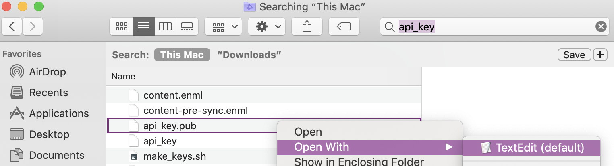
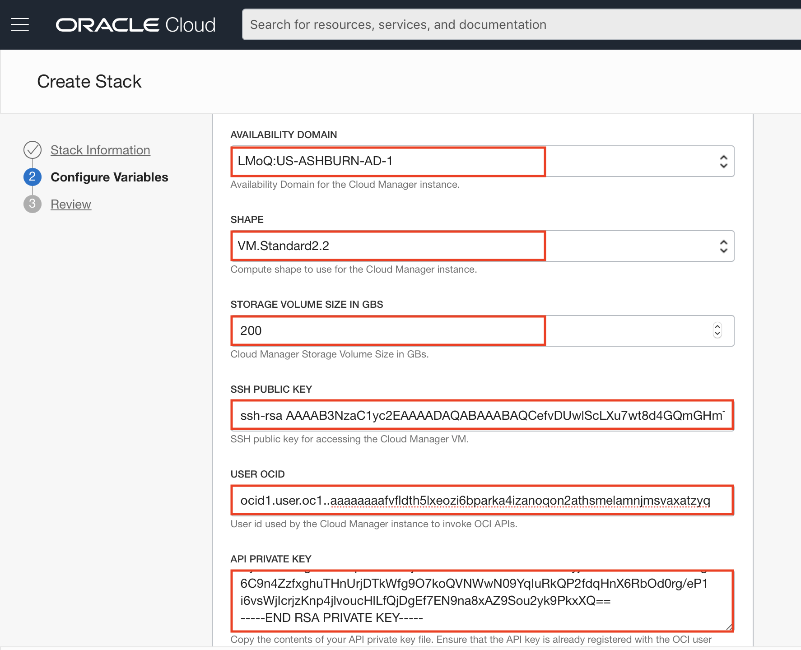
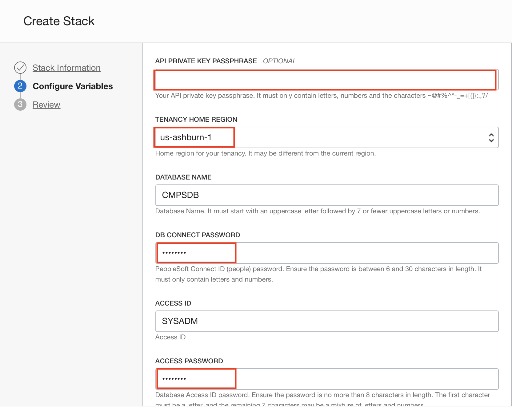
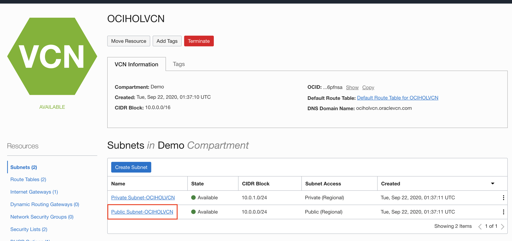
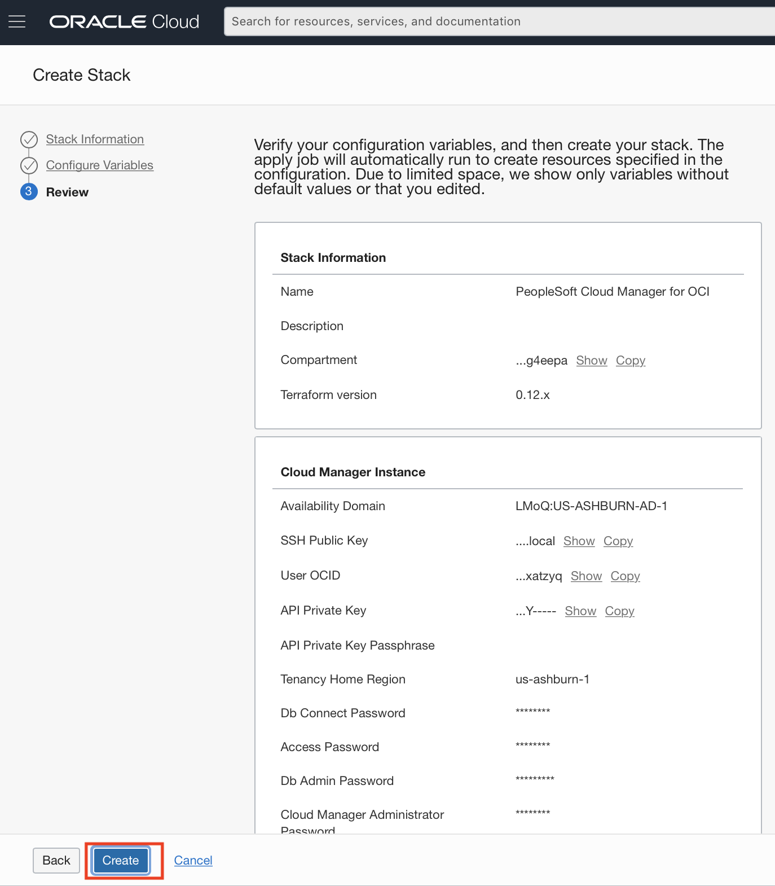
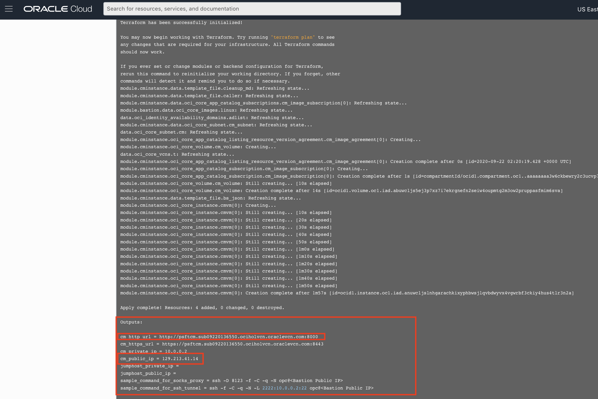
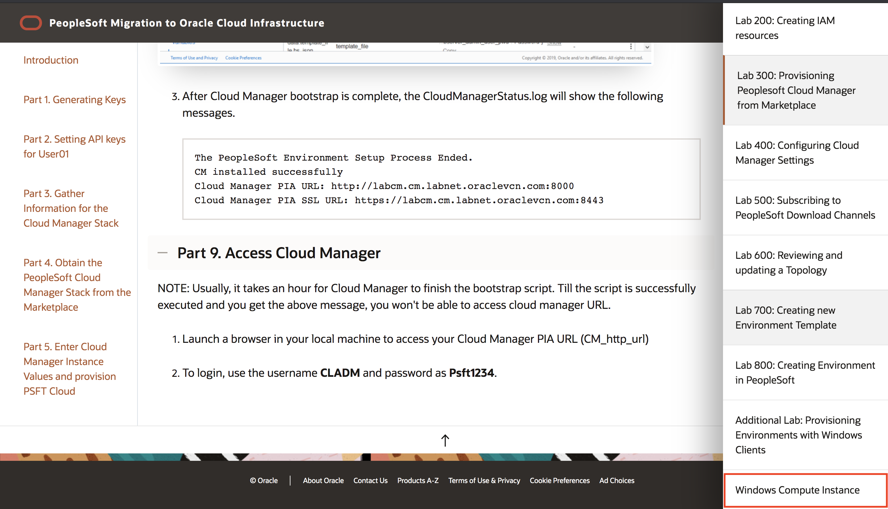

# Lab 300 : Provisioning Cloud Manager from Resource Manager.

## Introduction
Resource Manager is an Oracle Cloud Infrastructure service that helps you install, configure, and manage resources. Resource Manager uses Terraform (which is part of the service) to codify your infrastructure in declarative configuration files, which allows you to review and edit, version, persist, reuse, and share them across teams. You can then use Resource Manager to provision Oracle Cloud Infrastructure resources using your Terraform configurations.

In this tutorial, you obtain the configuration files, or stack, for Cloud Manager from the Oracle Cloud Infrastructure Marketplace, and use Resource Manager to create an instance and link it with associated resources such as a Virtual Cloud Network (VCN), subnet, gateways, and route tables. You enter the necessary passwords and other information in the Resource Manager interface and choose the types of resources created.
Time: 80 min

## Part 1. Generating Keys

1. Ensure Git Bash is installed on your laptop/workstation.

2. Download the following script - [make_keys.sh](make_keys.sh)

3. Launch Terminal for Mac or Git Bash for Windows command line and navigate to the folder where the file was downloaded.

If the file was downloaded in the Downloads folder, you can type the following command: **cd ~/Downloads**. (If your file was downloaded in a different folder, replace downloads with the name of the folder it was downloaded into.)

4. Give permission to the file by typing in the command line: **chmod u+rx make_keys.sh**

6. For Windows, run the script as **"bash make_keys.sh"**

For Mac terminal run the command - **"./make_keys.sh"**


7. Below set of key files are generated.  There are two sets of keys:

	I.	API Signing keys – api\_key and api\_key.pub

	II.	SSH key pair – id\_rsa and id\_rsa.pub

```
Note: These Keys are necessary for you to be able to securely connect into your PeopleSoft Cloud Tenancy.
```


## Part 2. Setting API keys for User01

1. Copy the contents of api_key.pub key (the one you have created through the script) as follows: 
- Right click on the api_key.pub and open with a text editor as shown below. 



- Copy all the content from the text editor and keep it in your clipboard to paste it in the OCI console.

2. In a browser, launch the OCI console. Login as **User01**. After you are successfully logged in, click on the **profile button on top right**. Click on your user name - **User01**.
   (**Refer to Lab 200 for details on how to login as User01.**)


2. Scroll to the bottom, on the left side click on **API Keys** and then click on **Add Public Key**


3. Click on **Paste public keys** and paste the content of **api_key.pub** (the one you just copied above). Click on **Add**.  


## Part 3. Gather Information for the Cloud Manager Stack

Paste the below information in a notepad. You will need it later while creating the stack.

1. From the same User detail page, copy the OCID by clicking on **copy**. 


2. On the top right, click on the region. Note the home region displayed. 


## Part 4. Obtain the PeopleSoft Cloud Manager Stack from the Marketplace

To obtain the PeopleSoft Cloud Manager stack:

1. On the Oracle Cloud Infrastructure console home page, click the top left three-line menu icon and select Marketplace -> Applications.


2. Under Filters on the left, select Stack from the Type drop-down list, and Oracle from the Publisher drop-down list. Search for Peoplesoft on the search bar. Click the PeopleSoft Cloud Manager tile.


3. On the Overview page for the PeopleSoft Cloud Manager stack, select the **compartment to install the instance**.
Review the **Oracle terms**, and then select the option indicating that you have reviewed and understand the conditions.
Click **Launch Stack**. 


4. On the Create Stack, Stack Information page, enter a stack name and description if desired.

Click Next


Continue with the steps in Enter Cloud Manager Instance Values.

## Part 5. Enter Cloud Manager Instance Values and provision PSFT Cloud

The Create Stack, Configure Variables page includes a list of the parameters needed to create and configure the Cloud Manager instance.

1. In the Cloud Manager Instance section, select the **Availability Domain as US-ASHBURN-AD-1**. 

2. For **Shape, select VM.Standard2.2**. 

3. Select the **storage volume size in GBs** for the secondary block volume for the Cloud Manager instance. We will set it as **200 GBs**.

4. For SSH public key, enter content of your **id_rsa.pub** key (the one you created with the script) in a single line, with no line feeds or spaces.

5. Enter your User OCID in a single line, with no line feeds or spaces.

6. For API private key, enter the contents of your **api_key** file. 
Below table summarizes the inputs in Configure Variables page.  

7. Leave API Private passphrase as blank (Enter if you have created one).



8. For **Tenancy Home Region**, Select the home region for your tenancy from the drop-down list.

9. Enter following value:

Attribute | Value
--------- | -----
DB CONNECT PASSWORD	| Psft1234
ACCESS PASSWORD | Psft1234
DB ADMIN PASSWORD | Psft1234#
CLOUD MANAGER ADMINISTRATOR PASSWORD | Psft1234
INTEGRATION GATEWAY USER PASSWORD | Psft1234
WEBLOGIC ADMINISTRATOR USER PASSWORD | Psft1234
WEB PROFILE USER PASSWORD | Psft1234
DOMAIN CONNECT PASSWORD | Psft1234




10. In the Networking section, enter a host name for the Cloud Manager instance.
This name will be used as part of the URL you use to access Cloud Manager in a browser.

11. Make sure the option **Create Network Resources** is selected.

12. Give **Network Name** as **OCIHOLVCN**

13. Clear the option **Create Private Subnets**

14. Clear the option **Create Subnets for Peoplesoft Components**

15. Clear the option for **Create a Jump Host**



16. Click Next. Review the configuration variables, and then click Create.  



17.	This will add a new stack and open the stack details page. You can navigate to Variables to see all the assigned variables.


18. Click on **Terraform Actions** -> **Plan**.


19. Give plan name as **plan-job-1** and click on **Plan**


20. After plan is succeeded, click on **Terraform Actions** -> **Apply**.


21. Give name as **apply-job-1** and click on **Apply**.


Terraform Apply job is a long-running process.  After it completes, the output from this job will have the IP address and PIA URL of CM instance.  To obtain those details, click on the Job name. 


On the job details page, click on **Logs** under Resources. 

Scroll at the bottom and make a **note of CM\_public\_ip and CM\_http\_url**. (Wait for a while if you can't see this information)



NOTE: If you don't have admin access in your laptop, before proceeding with Part 6, please follow 
Lab: Windows Compute Instance (This is after Additional Labs, after lab 800).



## Part 6. Set up hosts file in your local machine

Below are the steps for both windows (step 1) and Mac (step 2). Make sure you have admin access in your local machine. If not, please follow the lab Windows Conpute Instance (See above screenshot). 

1.	Windows: Add an entry to C:\Windows\System32\drivers\etc\hosts entry on your laptop/workstation as shown below. Use the hostname value for attribute CM\_http\_url. (Hostname is everything after **http://** and before **:8000**, in my case it is **psftcm.sub09220136550.ociholvcn.oraclevcn.com**. Check your CM\_http\_url from above step and modify it as per)

	I.	Open Windows Search “Notepad”. Right Click on Notepad and open as Administrator.

	

	II.	Go to File -> Open -> C:\Windows\System32\drivers\etc\hosts, and append below entry

	CM_public_ip  Hostname of CM_http_url

	Example: 

	```
	129.213.145.213  labcm.cm.labnet.oraclevcn.com
	```
23.	Mac: Add an entry to /private/etc/hosts entry on your laptop/workstation. Use the hostname value for attribute CM\_http\_url. (Hostname is everything after **http://** and before **:8000**, in my case it is psftcm.sub09220136550.ociholvcn.oraclevcn.com. Check your CM\_http\_url from the above step and modify it as per)

	I.	Open Terminal and type **sudo vi /private/etc/hosts**. It will ask you for password, it's your laptop password. 
	Press **i** in your keypad. This will take you to the insert mode and now you can edit the file.

	If you already have contents in the file, append the following at the end of the file:
	```
	CM_public_ip  Hostname of CM_http_url
	```
	

	To quit from the vi editor, press escape, then **:wq** and press enter.

## Part 7. Accessing Cloud Manager using SSH

SSH key pair required to access Cloud Manager instance was created in Part 1 of Lab 300. 

1.	Launch terminal or Git Bash and navigate to the keys folder. 

2.	Retrieve the Cloud Manager IP address.  It was provided as output when the stack was applied.


3.	Navigate to the folder where you have created the keys. SSH into the Cloud Manager instance using the below command. 

```
$ ssh -i id_rsa opc@129.213.145.213 //Use your IP
```

## Part 8. Monitoring Cloud Manager

1. SSH into Cloud Manager instance to check status of the deployment.  Monitor Cloud Manager bootstrap installation using the below command.

```
$ tail -f /home/opc/bootstrap/CloudManagerStatus.log
```


2. While Cloud Manager is being installed, review Associated Resources for the list of all resources created by automation.

The deployment automation (Resource Manager Stack) provisions numerous resources in the tenancy.  To find the list of resources that were created, navigate to OCI console -> Resource Manager -> Stacks -> <Stack> Apply Job details.  On this page, click Associated Resources under Resources.  


3. After Cloud Manager bootstrap is complete, the CloudManagerStatus.log will show the following messages. 

		The PeopleSoft Environment Setup Process Ended.
		CM installed successfully
		Cloud Manager PIA URL: http://labcm.cm.labnet.oraclevcn.com:8000 
		Cloud Manager PIA SSL URL: https://labcm.cm.labnet.oraclevcn.com:8443

## Part 9. Access Cloud Manager

NOTE: Usually, it takes an hour for Cloud Manager to finish the bootstrap script. Till the script is successfully executed and you get the above message, you won't be able to access cloud manager URL. 

1. Launch a browser in your local machine to access your Cloud Manager PIA URL (CM\_http\_url) 

2. To login, use the username **CLADM** and password as **Psft1234**.


