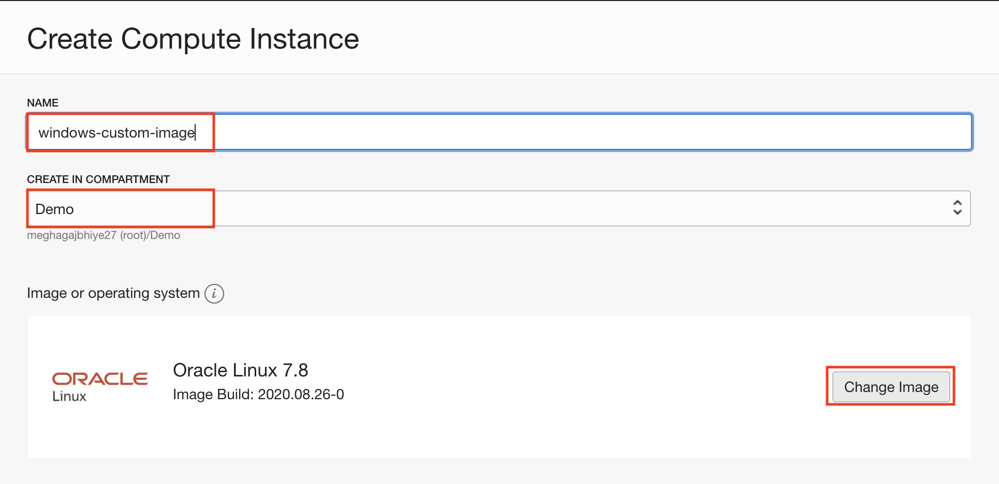
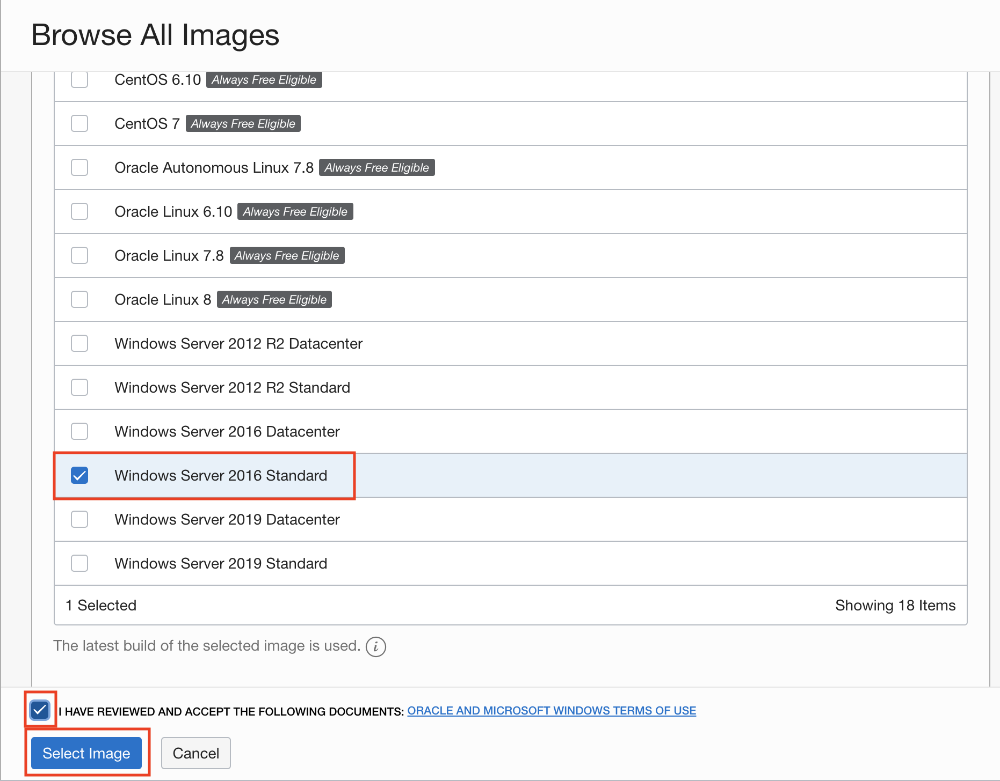
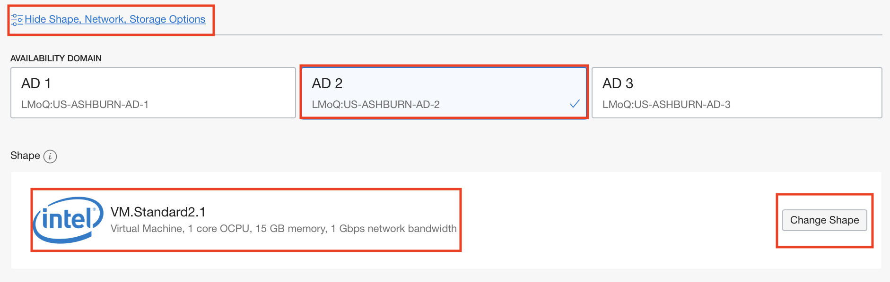
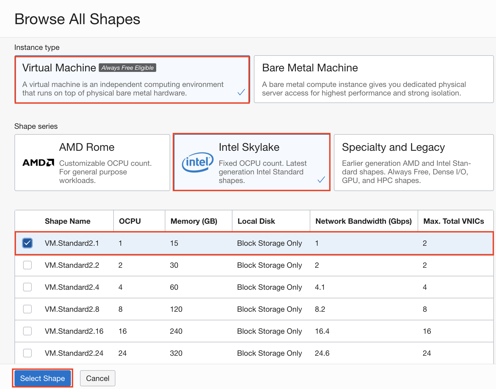
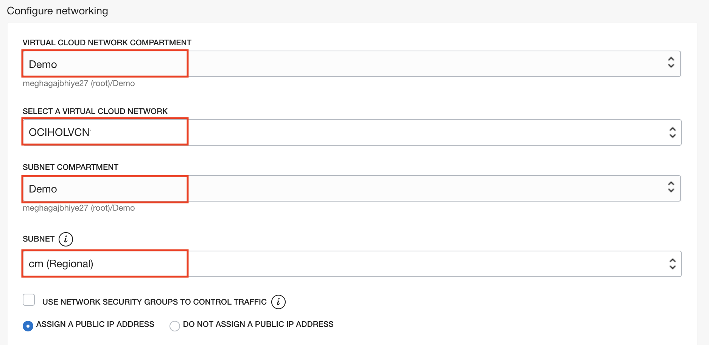
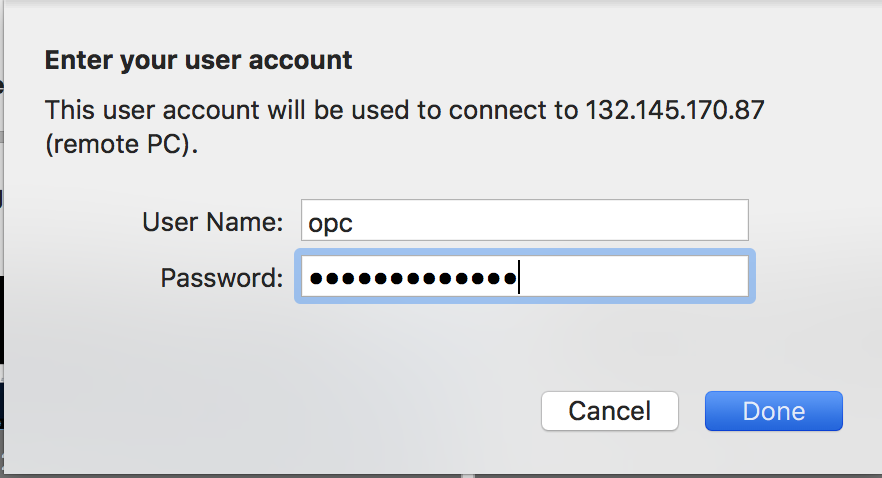

# Windows VM Compute Lab (Optional): Provision Windows Compute in OCI

## Introduction

NOTE: Below section is only for those who doesn't have Admin access in their local machine

## Part 1. Create Windows Instance

1. On the Oracle Cloud Infrastructure console home page, click Create a VM Instance under Quick Action

 

2. On the Create Compute Instance page, enter a name for the Windows instance eg. windows-custom-image.

 

3. Click on **Change Image**. Select Windows Server 2016 Standard, and accept the document.

 

4. Click on **Show Shape, Network, Storage Options**. Please select Availability Domain as AD-2. 

 

5. Make sure that the shape is **VM.Standard.2.1**. If not, click on **change shape** and select Instance Type as **Virtual Machine**, Shape Series as **Intel Skylake**, and Shape name as **VM.Standard.2.1**. 

 

6. In **configure networking** section, make sure that Virtual Cloud Network Compartment is **Demo**, Virtual Cloud Network is **OCIHOLVCN**, Subnet Compartment is **Demo** and Subnet is **cm (Regional)**.

 

7. Click Create.

8. On the Details page, make a note of the Public IP Address, the username, opc and copy Initial Password to your local clipboard.

## Part 2. Access the Windows Instance with Remote Desktop Connection

After you create the Windows instance, use Remote Desktop Connection to access it.

1. Launch Remote Desktop Connection, for example from the Start menu of a local machine.

NOTE: If you have not installed Remote Desktop Connection, please do so throught this [link](https://www.microsoft.com/en-us/p/microsoft-remote-desktop/9wzdncrfj3ps)

2. **Steps for Windows machine**: In the Computer field, enter the Public IP address of the Microsoft Windows VM that you noted in the previous section. Enter opc in the User name field. 

Click Connect.
Enter the default password you noted from the instance details page.

**Steps for Mac machine**: Depending on the software, these steps might differ. Click on + sign and select Desktop or Add PC. Enter the Public IP address. Give Username as opc and password that you copied previously.

3. Click Yes on the security message, which mentions that the identity of the remote computer cannot be verified.

4. Change the password to **Psft@12345678**. 
