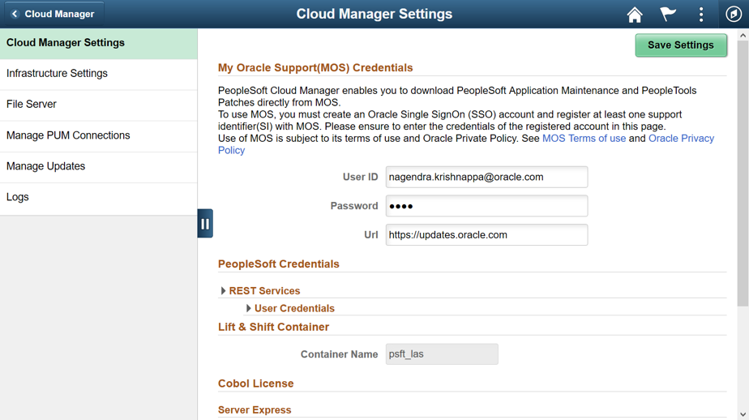
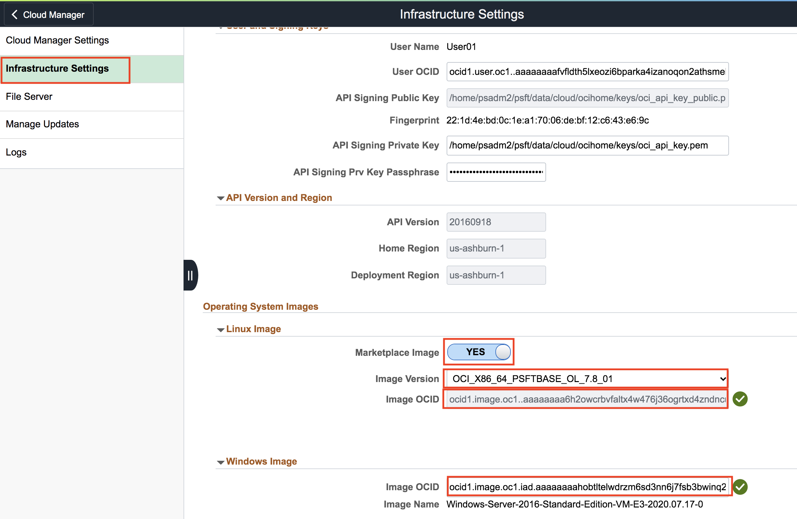
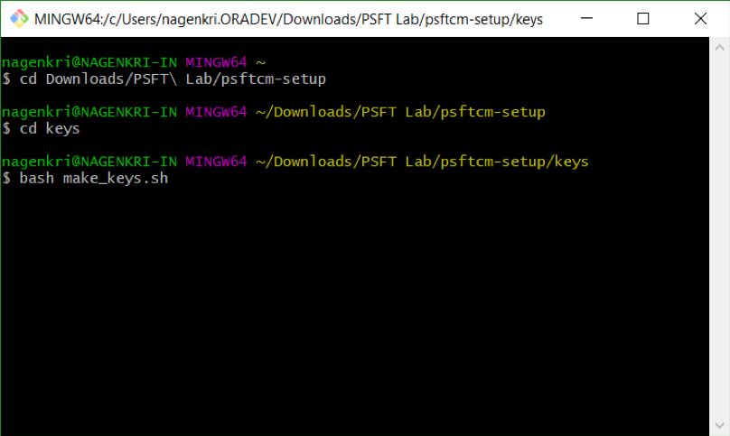

# Lab 400 : Configure Cloud Manager Settings

## Introduction
This lab will guide you on how to configure the system and infrastructure settings on Cloud Manager

Time: 15 min

## Part 1. Configuring settings

1.	Navigate to **Cloud Manager Dashboard -> Cloud Manager Settings -> Cloud Manager Settings**.

2.	Update **My Oracle Support (MOS) Credentials**. This credential is the same as the username and password you enter when you access http://support.oracle.com. Please make sure that you have an account and you can access http://support.oracle.com, this is required to download DPKs and PRPs automatically. 

3.	Navigate to Infrastructure Settings and update Operating System Images.     
    For Linux, enable **“Marketplace Image”** radio button and choose the latest version from the displayed list (see the screenshot below).

    For Windows image, as per your home region, please select the OCID of the vanilla custom image from this [website](https://docs.cloud.oracle.com/en-us/iaas/images/image/146ab34c-064a-4255-b5ea-e26bbfa6591d/).

    For ex, in my case it is for us-ashburn-1:	**ocid1.image.oc1.iad.aaaaaaaahobtltelwdrzm6sd3nn6j7fsb3bwinq2ggmpcnsgdvhihnz2mhga**
 
    

4.	Click ‘**Save**’ to save the configuration. 

5.	Click ‘**Refresh OCI Metadata**’ button on top of the page and wait for a few minutes.

6.	Next, navigate to **File Server tab**.  Accept the defaults. For Mount Target field, type “**lab**”.

7.	Click **Create**.  This action will create a file server in a few minutes. Please wait until the file server status shows ‘**FSS Configured**’, and then the system will be ready for downloads. 

