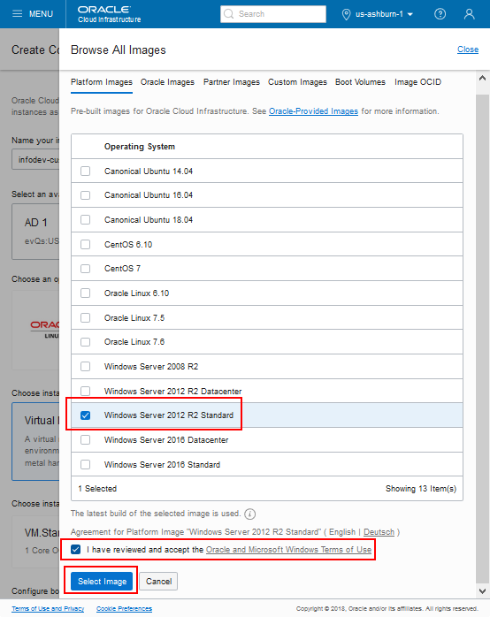
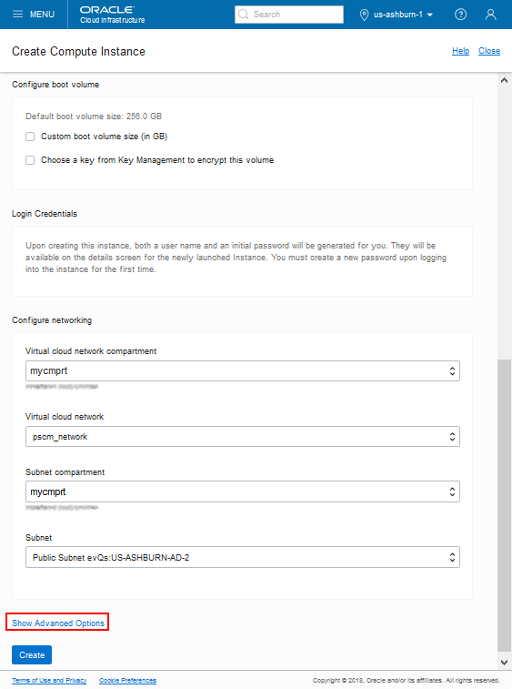
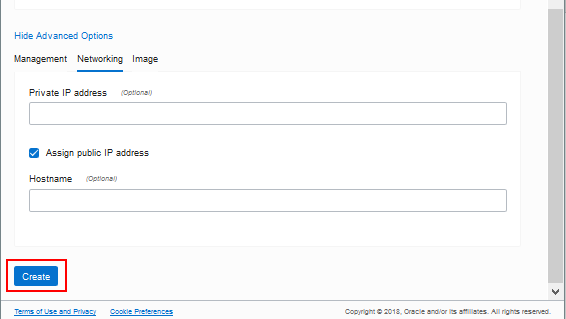
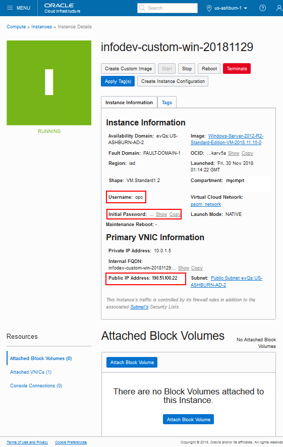

# Lab 400 : Configure Cloud Manager Settings

## Introduction
This lab will guide you how to configure the system settings on Cloud Manager

Time: 20 min

## Part 1. Create Windows Instance

1. On the Oracle Cloud Infrastructure console home page, click Create a VM Instance under Quick Action

    

2. On the Create Compute Instance page, enter a name for the Windows instance.

     

3. On the Browse All Images page, select the Platform Images tab.

4. Select the Windows Server 2016 Standard image.

5. Read the Oracle terms and restrictions, and select the option agreeing to the terms.

6. Click Select Image.

     

7. On the Create Compute Instance page, select the option Virtual Machine. Select a instance shape such as VM.Standard2.1.

8. Select a OCIHOLVCN from the Virtual Cloud Network drop-down list, and select Public subnet.

     

9. Click Create.

    

10. On the Details page, make a note of the Public IP Address, 198.51.100.22 in this example, and the username, opc.

    

11. Click the link to Copy the Initial Password to your local clipboard.

## Part 2. Access the Windows Instance with Remote Desktop Connection

After you create the Windows instance, use Remote Desktop Connection to access it.

1. Launch Remote Desktop Connection, for example from the Start menu of a local Microsoft Windows host.

2. In the Computer field, enter the Public IP address, which is 198.51.100.22 in this example, of the Microsoft Windows VM that you noted in the previous section. Enter opc in the User name field.

3. Click Connect.

4. Enter the default password you noted from the instance details page.

5. Click Yes on the security message, which mentions that the identity of the remote computer cannot be verified.

6. Change the password to a complex password. You will change it again in a later section.

## Part 4. Create a Generalized Image

1. In the Windows instance VM, open a browser and go to Windows Generalized Image Support Files.

2. Download the support file that is appropriate for the shape you are using.

3. Save the file in the default location.

4. Right-click the file you downloaded, and select Run as Administrator.

5. Extract the files to C:\Windows\Panther. The following files are extracted for all Windows Server versions:

    - Generalize.cmd
    - Specialize.cmd
    - unattend.xml
    - Post-Generalize.ps1

6. Right-click Generalize.cmd and select Run as Administrator. The process typically ends the Remote Desktop session. If not, log out of the session.

7. Wait a few minutes for the process to complete.

## Part 6. Create a Custom Image

1. In Compute Console, select Compute, Instances.

2. Locate the updated Windows instance.

3. Click the Actions icon, and select Create Custom Image.

4. Select the compartment where you want the custom image to reside.

5. Enter a name, such as custom-win-image.

6. Click Create Custom Image

7. Monitor the progress on the Compute, Custom Images page.

8. When the status of the custom image changes to Available, copy the OCID for the image. You use it in the next section.

**NOTE**: After you create the custom image, you can safely remove the instance used to create the image.

## Part 7. Configuring settings

1.	Navigate to **Cloud Manager Dashboard -> Cloud Manager Settings -> Cloud Manager Settings**.

2.	Update **My Oracle Support (MOS) Credentials**.  This is required to download DPKs and PRPs automatically. 

3.	Navigate to Infrastructure Settings and update Operating System Images.     
    For Linux, enable **“Marketplace Image”** radio button and choose the latest version from the displayed list.

    For Windows image, please paste the OCID of the custom image you just created.
 
    

4.	Click ‘**Save**’ to save the configuration. 

5.	Click ‘**Refresh OCI Metadata**’ button on top of the page and wait for few minutes.

6.	Next, navigate to **File Server tab**.  Accept the defaults.   For Mount Target, type “**lab**”.

7.	Click Create.  This action will create a file server in a few minutes. 

    This will take some time. Please wait until the file server status shows ‘FSS Configured’, and then the system will be ready for downloads. 

