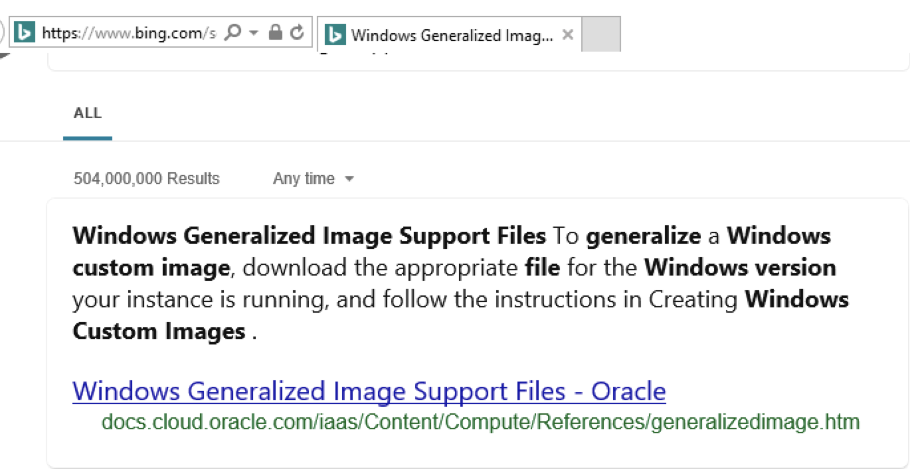
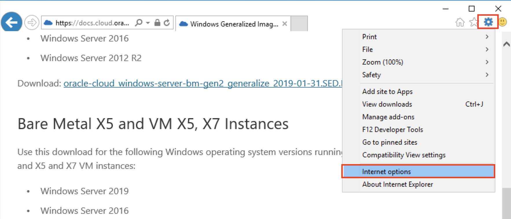
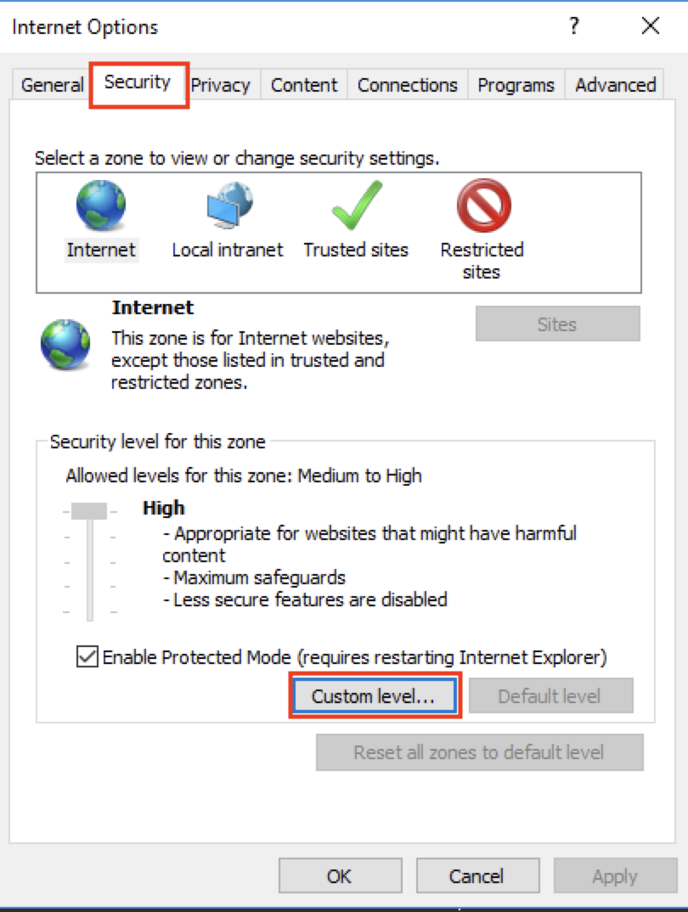
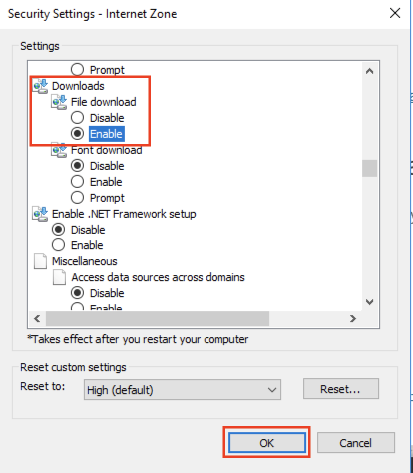
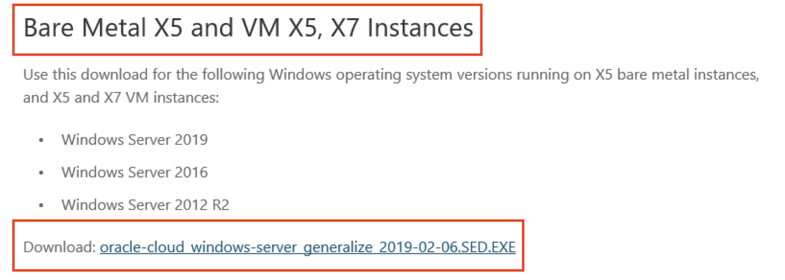
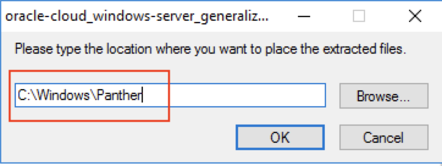
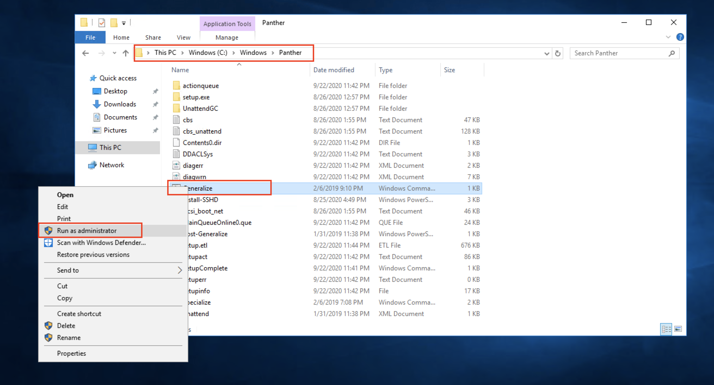
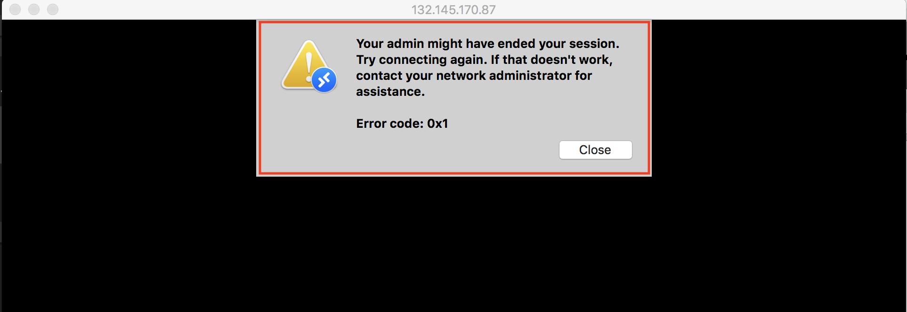

# Lab 400 : Configure Cloud Manager Settings

## Introduction
This lab will guide you how to configure the system settings on Cloud Manager

Time: 30 min

## Part 1. Create Windows Instance

1. On the Oracle Cloud Infrastructure console home page, click Create a VM Instance under Quick Action

 

2. On the Create Compute Instance page, enter a name for the Windows instance eg. windows-custom-image.

 

3. Click on **Change Image**. Select Windows Server 2016 Standard, and accept the document.

 

4. Click on **Show Shape, Network, Storage Options**. Please select Availability Domain as AD-2. 

 

5. Make sure that the shape is **VM.Standard.2.1**. If not, click on **change shape** and select Instance Type as **Virtual Machine**, Shape Series as **Intel Skylake**, and Shape name as **VM.Standard.2.1**. 

 

6. In **configure networking** section, make sure that Virtual Cloud Network Compartment is **Demo**, Virtual Cloud Network is **OCIHOLVCN**, Subnet Compartment is **Demo** and Subnet is **Public Subnet-OCIHOLVCN**.

 

7. Click Create.

8. On the Details page, make a note of the Public IP Address, the username, opc and copy Initial Password to your local clipboard.

9. Click on Public Subnet-OCIHOLVCN from the same windows details page -> Default Security List for OCIHOLVCN -> Add Ingress Rule. Now we will add another ingress rule to open RDP port as mentioned in the screenshot. 

SOURCE CIDR: 0.0.0.0/0

IP PROTOCOL: RDP (TCP/3389)

Click on **Add Ingress Rule**.

## Part 2. Access the Windows Instance with Remote Desktop Connection

After you create the Windows instance, use Remote Desktop Connection to access it.

1. Launch Remote Desktop Connection, for example from the Start menu of a local Microsoft Windows host.

2. Windows: In the Computer field, enter the Public IP address of the Microsoft Windows VM that you noted in the previous section. Enter opc in the User name field. 

Click Connect.
Enter the default password you noted from the instance details page.

Mac: Click on + sign and select Desktop. Enter the Public IP address. Give Username as opc and password that you copied previously.

3. Click Yes on the security message, which mentions that the identity of the remote computer cannot be verified.

4. Change the password to a complex password. 

## Part 3. Create a Generalized Image

1. In the Windows instance VM, open a browser and search for Windows Generalized Image Support Files.

Go to Internet Settings -> Internet Options -> Security -> Custom Level...

Scroll down to Downloads and enable the file download. 

2. Download the support file that is appropriate for the shape you are using. In our case, it's VM so download the following which says VM X5, X7 instances:

3. Save the file in the default location.

4. Right-click the file you downloaded, and select Run as Administrator. 

5. Extract the files to C:\Windows\Panther (see screenshot below). The following files are extracted for all Windows Server versions:

    - Generalize.cmd
    - Specialize.cmd
    - unattend.xml
    - Post-Generalize.ps1

6. Right-click Generalize.cmd and select Run as Administrator. 

7. The process typically ends the Remote Desktop session. If not, log out of the session. Wait a few minutes for the process to complete.

## Part 4. Create a Custom Image

1. In Compute Console, navigate to the three-line menu on top left and click on Compute -> Instances.

2. Locate the Windows instance you created and click on it.

3. Click the Actions icon, and select Create Custom Image.

4. Select the compartment where you want the custom image to reside.

5. Enter a name, such as custom-win-image.

6. Click Create Custom Image

7. Monitor the progress on the Compute, Custom Images page.

8. When the status of the custom image changes to Available, copy the OCID for the image. You use it in the next section.

**NOTE**: After you create the custom image, you can safely remove the instance used to create the image.

## Part 5. Configuring Ingress Ports for FSS mount. 

1. Click on three-line menu on the top left and navigate to  Networking -> Virtual Cloud Networks -> OCIHOLVCN -> Default Security List for OCIHOLVCN -> Add Ingress Rules. 

2. Add the following ingress rule allowing TCP traffic:

    Source CIDR: 0.0.0.0/0  
    IP Protocol: TCP  
    Source Port Range: All  
    Destination Port Range: 2048-2050   
    
Click + Another Ingress Rule to add more rules.

3. Add the following ingress rule allowing UDP traffic:

    Source CIDR: 0.0.0.0/0  
    IP Protocol: UDP  
    Source Port Range: All  
    Destination Port Range: 2048   

Click + Another Ingress Rule to add more rules.

4. Create a third ingress rule allowing traffic to a Destination Port Range of 111 for the NFS rpcbind utility.

    Source CIDR: 0.0.0.0/0  
    IP Protocol: TCP  
    Source Port Range: All  
    Destination Port Range: 111  
    
Click + Another Ingress Rule to add more rules.

5. Create a fourth ingress rule allowing traffic to a Destination Port Range of 111 for the NFS rpcbind utility with UDP

    Source CIDR: 0.0.0.0/0  
    IP Protocol: UDP  
    Source Port Range: 111  
    Destination Port Range: All   

When you’re done, click the Add Ingress Rules button.

## Part 5. Configuring settings

1.	Navigate to **Cloud Manager Dashboard -> Cloud Manager Settings -> Cloud Manager Settings**.

2.	Update **My Oracle Support (MOS) Credentials**. This credential is the same as the username and password you enter when you access [http://support.oracle.com/](support.oracle.com). Please make sure that you have an account and you can access [http://support.oracle.com/](support.oracle.com). This is required to download DPKs and PRPs automatically. 

3.	Navigate to Infrastructure Settings and update Operating System Images.     
    For Linux, enable **“Marketplace Image”** radio button and choose the latest version from the displayed list.

    For Windows image, please paste the OCID of the custom image you just created.
 
    

4.	Click ‘**Save**’ to save the configuration. 

5.	Click ‘**Refresh OCI Metadata**’ button on top of the page and wait for few minutes.

6.	Next, navigate to **File Server tab**.  Accept the defaults.   For Mount Target, type “**lab**”.

7.	Click Create.  This action will create a file server in a few minutes. 

    This will take some time. Please wait until the file server status shows ‘FSS Configured’, and then the system will be ready for downloads. 

