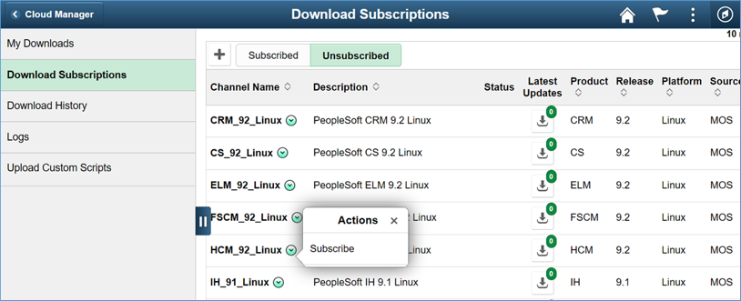
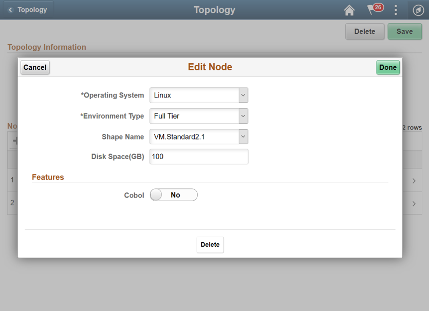
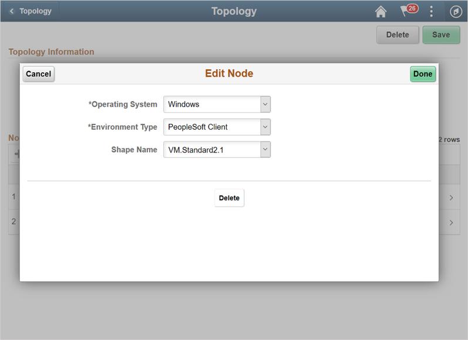
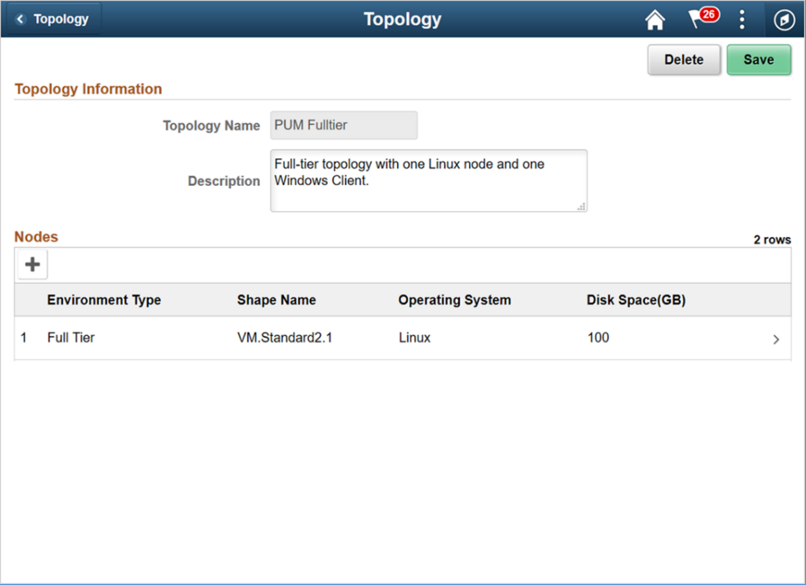

# Lab 500 : Reviewing and updating a Topology

## Introduction
Time: 10 mins

## Part 1

1.	Navigate to Dashboard | Topology | PUM Fulltier topology. This topology will be used to create a new environment. 

2.	Review the nodes and update the Shapes.  Click Full Tier node and select a shape that is available in your AD 2. 
In this case, select VM.Standard2.1 or VM.Standard2.2. 
Review the available shapes in your AD as explained in Lab 100.

3.	Delete the Windows node from the topology. Click ‘Delete’ on the page shown below and save the topology. 

4.	When you are ready, Click Save. The topology should now look as shown below.

