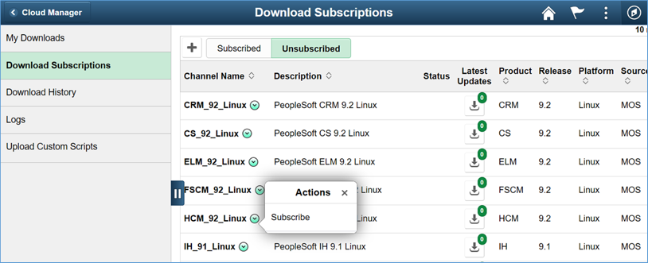

# Lab 500 : Subscribing to PeopleSoft Download Channels

## Introduction

**Estimated Lab Time** : Depends upon download speed and number of subscribed channels.  Around 60 mins for this example. 

## Part 1

1.	Navigate to Cloud Manager Dashboard -> Repository -> Download Subscriptions.

2.	Go to the Unsubscribed tab.

3.	On a download channel of your choice, click on the related actions menu and click Subscribe. E.g., HCM_92_Linux.
 Monitor the Logs page to check for progress. 

4. Go to subscribed tab and you can now see HCM_92_Linux progress status. This takes 1+ hour to complete. Make sure you refresh the page to check the current progress. Proceed to next Lab only when you see a green check as the status as shown in the picture.

You may now proceed to the next lab.

## Acknowledgements

**Created By/Date**   
- Rich Konopka, Peoplesoft Specialist, October 2020  
- Megha Gajbhiye, Cloud Solutions Engineer, October 2020  

**Last Updated By/Date**    
- Sara Lipowsky, Cloud Solutions Engineer, October 2020  

## See an issue?

Please submit feedback using this [form](https://apexapps.oracle.com/pls/apex/f?p=133:1:::::P1_FEEDBACK:1). Please include the **workshop name**, **lab** and **step** in your request. If you don't see the workshop name listed, please enter it manually. If you would like for us to follow up with you, enter your email in the **Feedback Comments** section.  