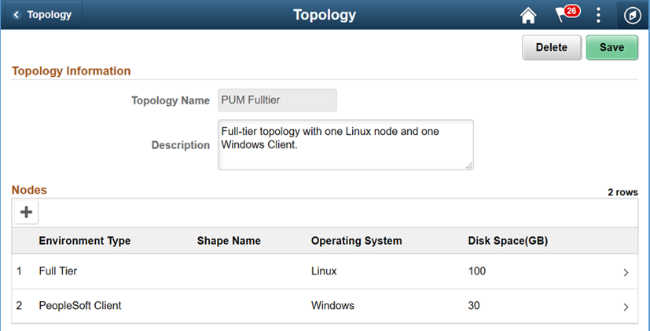
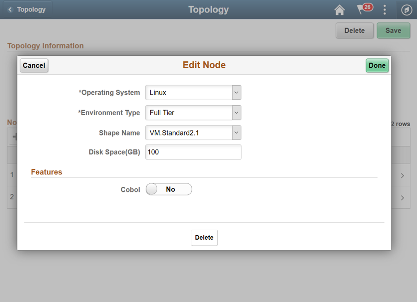
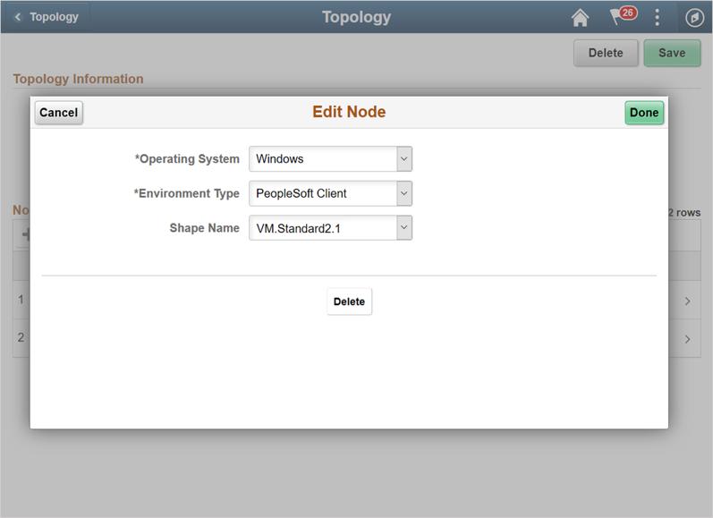
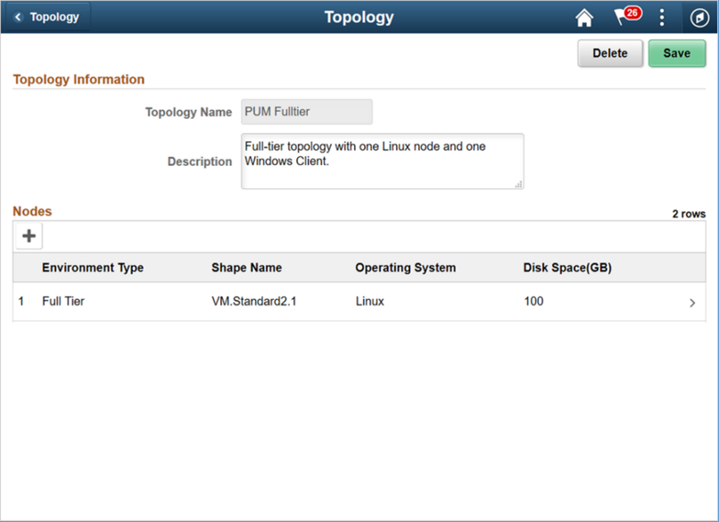
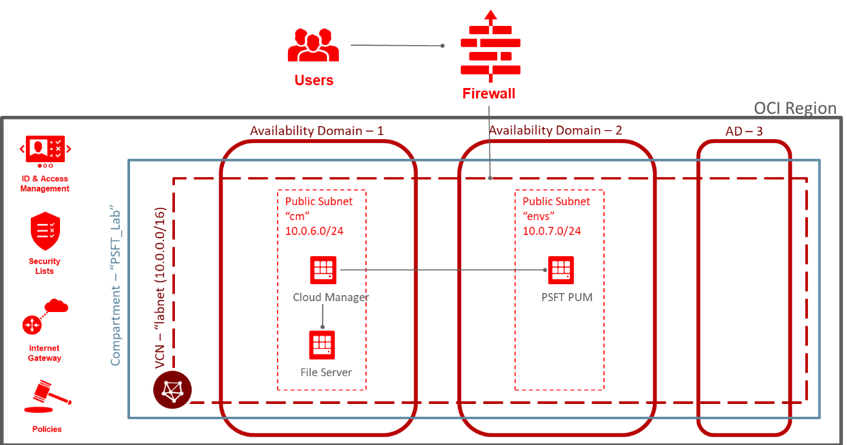
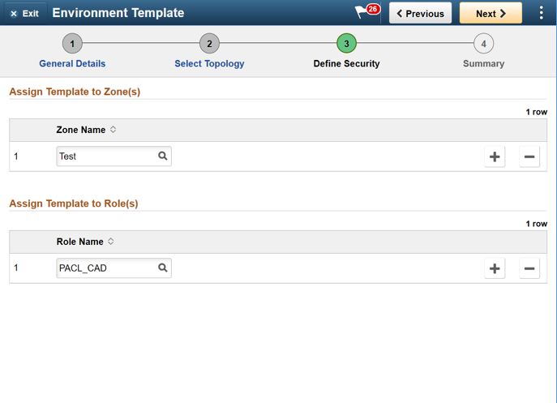
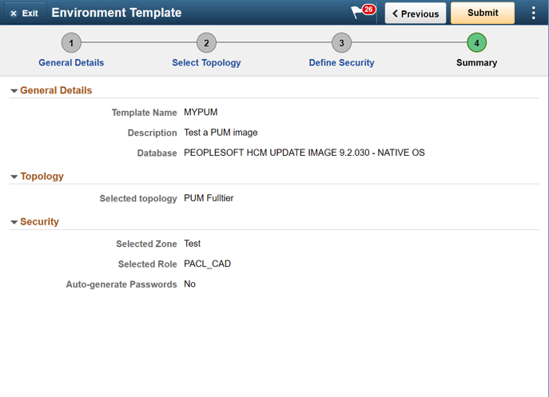

# Lab 600 : Creating new Environment Template

## Introduction

Time: 10 mins

## Part 1

1.	Navigate to Dashboard -> Environment Template.  
Click Add New Template button. Provide below details and click Next. 

Name | MYPUM
---- | -----
Description	| Test a PUM image
Database | Click on Search icon and select a downloaded DPK.  For example. PEOPLESOFT HCM UPDATE IMAGE 9.2.030 - NATIVE OS



2.	On Select Topology page, click on search icon to search for a topology and select the PUM Fulltier topology.



3.	Expand the Custom Attributes and select the PUM Fulltier topology and click Edit Custom Attributes. 



4.	Expand the Region and Availability Domains section.  Select the Region and Availability Domain in which Cloud Manager instance is not deployed. 



Refer to Lab 100 to review tenancy service limits and find the AD which has the required shape available for provisioning. In this exercise, for trial accounts, AD 2 should have the required shapes. 

Refer to the following for network topology:




**Region and Availability Domains**

1 | Region | us-ashburn-1
2 | Primary Availability Domain | evQs:US-ASHBURN-AD-2 **(Select an AD 2, where shapes are available for use)**
3 | Compartment	| PSFT_Lab
4 | Virtual Cloud Network | Labnet

5.	Expand each of the sub-sections under Full Tier and PeopleSoft Client and provide inputs. The defaults for many parameters can be changed optionally.  


Full Tier | General Settings
--------- | ----------------
1 |	PeopleSoft Deployment Path  | /u01/app/oracle/product
2 |	Database Access Id | SYSADM
3 |	Database Connect Id | people
4 |	Enable EM agent | No
5 |	Weblogic Administrator Username | system
6 |	Database Name | MYPUM
7 |	Gateway Administrator Username | administrator
8 |	Database Operator Id | PS
9 |	Database Server Port | 1522
10 | Database Type | SYS
11 | Enable Multi Language | NO
12 | Pre Provision Custom Script | -
13 | Post Provision Custom Script | -


Full Tier | Subnet Settings
--------- | ---------------
1 | Subnet For Primary Instance | Select a subnet.  E.g. envs


```
Note – Since there is only one subnet, the ‘envs’ subnet is automatically chosen when AD2, PSFT_Lab compartment and labnet VCN is chosen in the earlier section. 
```


Full Tier | Domain Settings | Web Server Settings
--------- | --------------- | -------------------
1 | Number of Domains | 1
2 | Authentication Domain | default
3 | HTTP PIA Port | 8000
4 | HTTPS PIA Port | 8443

Full Tier | Domain Settings | Appserver Settings
--------- | --------------- | ------------------
1 | Number of Domains | 1
2 | Number of App Server Instance (PSAPPSRV services) Per Domain | 2
3 | Number of Query Server Instances(PSQRYSRV services) Per Domain | 1
4 | Number of SQL Access App Server(PSSAMSRV services) Per Domain | 1
5 | Number of Jolt Listener(Jolt Handler) Per Domain | 3
6 | Jolt Port | 9033
7 | WSL Port | 7000
8 | Enable IB settings on first domain | YES
9 | Number of App Server instance(PSAPPSRV services) for IB | 2
10 | Number of SQL Access App Server(PSSAMSRV services) for IB | 1
11 | Number of PSBRKHND instances for IB | 1
12 | Number of PSSUBHND instances for IB | 1
13 | Number of PSPUBHND instances for IB | 1


Full Tier | Domain Settings | Process Scheduler Settings
--------- | --------------- | --------------------------
1 | Number of Domains | 1
2 | Number of App Engine Server Instances(PSAESRV services) Per Domain | 2
3 | Number of App Engine Server Instances(PSDSTSRV services) Per Domain | 2\


Full Tier | Domain Settings | Process Scheduler Server Definition Parameters
--------- | --------------- | ----------------------------------------------
1 | Application Engine | 1
2 | XML Publisher | 1
3 | COBOL SQL | 1
4 | Optimization Engine | 1
5 | SQR Process | 1
6 | SQR Report | 1
7 | Max Api Aware | 1

Full Tier | Domain Settings | Advanced
--------- | --------------- | --------
None | | 

6.	Click Next to configure zone and role. Select options as shown below. 



7.	Click Next.  Review the page and click Submit to save the template. 




