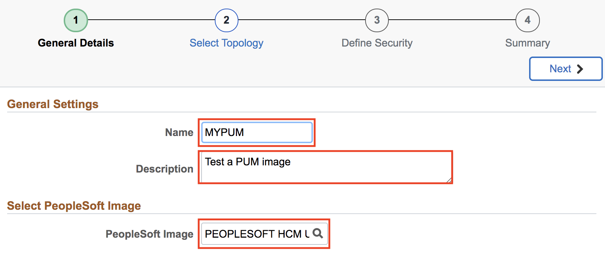
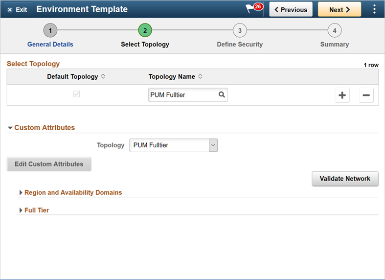
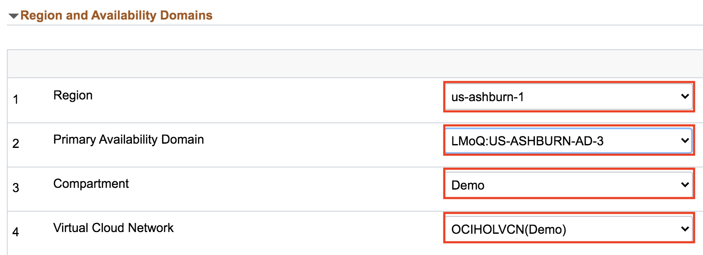
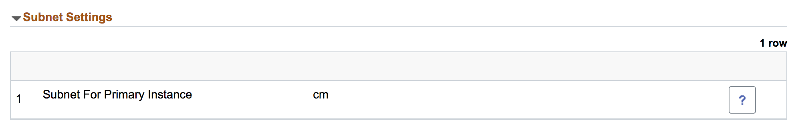
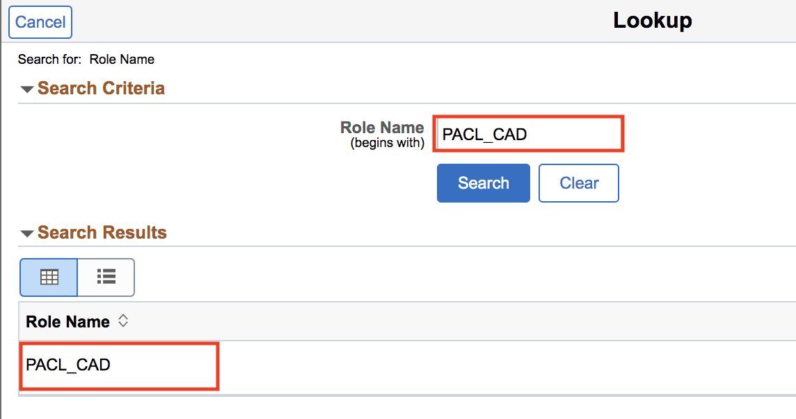
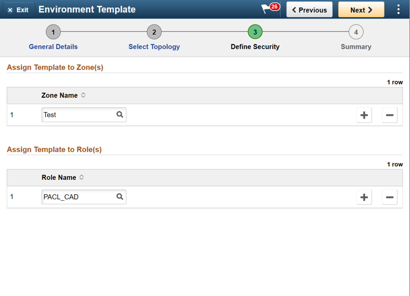

# Lab 700 : Creating new Environment Template

## Introduction

Time: 10 mins

## Part 1

1.	Navigate to Dashboard -> Environment Template.  
Click Add New Template button. Provide below details and click Next. 

Name | MYPUM
---- | -----
Description	| Test a PUM image
Database | Click on Search icon and select a downloaded DPK.  For example. PEOPLESOFT HCM UPDATE IMAGE 9.2.030 - NATIVE OS

2.	On Select Topology page, click on search icon to search for a topology and select the PUM Fulltier topology.

3.	Expand the Custom Attributes and select the PUM Fulltier topology and click Edit Custom Attributes. 

4.	Expand the Region and Availability Domains section. 

Number | Resource Type | Input
--------- | --------------- | -------------------
1 | Region | us-ashburn-1
2 | Primary Availability Domain | evQs:US-ASHBURN-AD-3 
3 | Compartment	| Demo
4 | Virtual Cloud Network | OCIHOLVCN

Refer to the following for network topology:

5.	Expand Full Tier -> General Settings. Make sure to give Database Operator Id as **PS**. Give a database name **MYPUMDB**. The defaults for many parameters can be changed; optionally, we will keep it as default.

6. Click on Subnet Settings and make sure the subnet is cm. 

7. Keep the rest of the field as default.

8.	Click Next to configure zone and role. Set Zone as **Test**. For role, click on Search Criteria and search for **PACL_CAD**. Select the role from **search results**.

Your screen should look like:

9.	Click Next.  Review the page and click Submit to save the template. 

