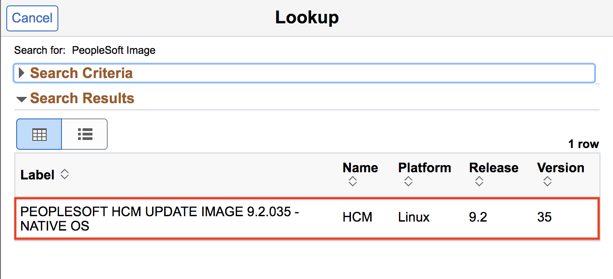
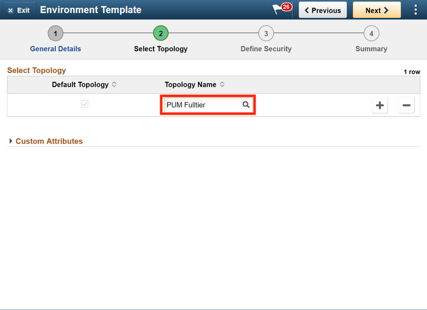
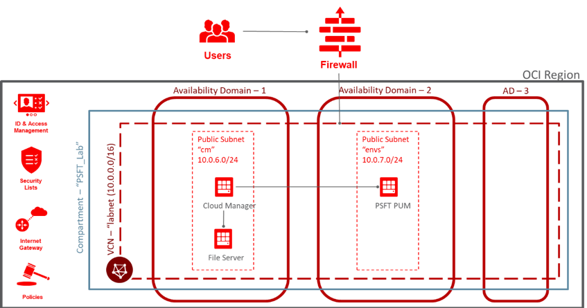
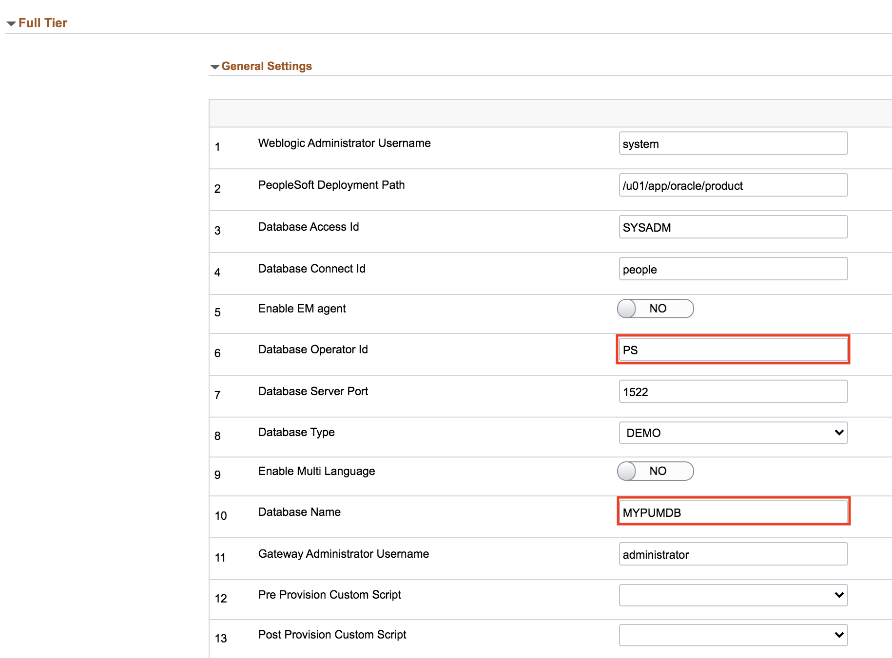
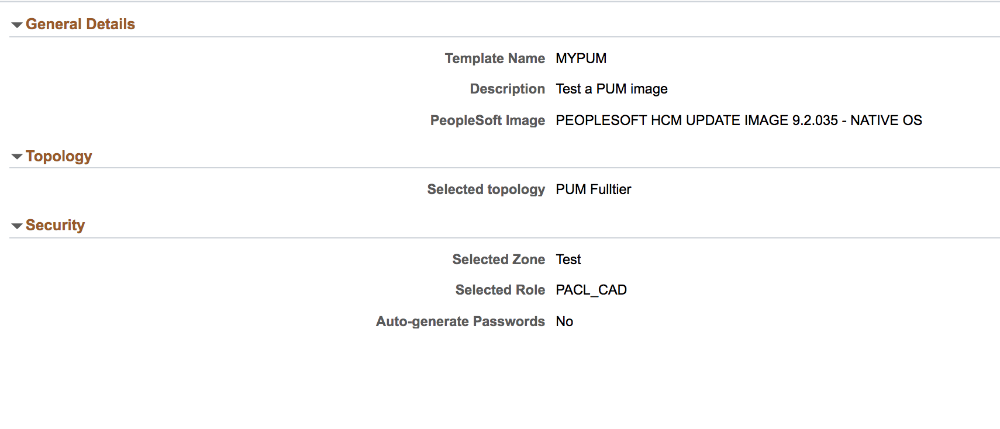

# Lab 700 : Creating new Environment Template

## Introduction

Time: 10 mins

## Part 1

1.	Navigate to Dashboard -> Environment Template.  
Click Add New Template button. Provide below details and click Next. 

Field | Value
---- | -----
Name | MYPUM
Description	| Test a PUM image
Peoplesoft Image | Don't type anything. Click on Search icon and select the downloaded DPK.  For example, in our case it is PEOPLESOFT HCM UPDATE IMAGE 9.2.030 - NATIVE OS

NOTE: Don't type PEOPLESOFT HCM UPDATE IMAGE 9.2.030 in the Peoplesoft Image field. If the DPKs are downloaded, you will be able to see it in the Search Results as shown in 2nd screenshot below. If you can't see it yet, please wait and refresh after a while.

2.	On Select Topology page, click on search icon to search for a topology and select the PUM Fulltier topology.

3.	Expand the Custom Attributes and select the PUM Fulltier topology and click Edit Custom Attributes. 

4.	Expand the Region and Availability Domains section. 

Number | Resource Type | Input
--------- | --------------- | -------------------
1 | Region | us-ashburn-1
2 | Primary Availability Domain | evQs:US-ASHBURN-AD-3 
3 | Compartment	| Demo
4 | Virtual Cloud Network | OCIHOLVCN

Refer to the following for network topology:

5.	Expand Full Tier -> General Settings. Make sure to give Database Operator Id as **PS**. Give a database name **MYPUMDB**. The defaults for many parameters can be changed; optionally, we will keep it as default.

6. Click on Subnet Settings and make sure the subnet is cm. 

7. Keep the rest of the field as default.

8.	Click Next to configure zone and role. Set Zone as **Test**. For role, click on Search Criteria and search for **PACL_CAD**. Select the role from **search results**.

Your screen should look like:

9.	Click Next.  Review the page and click Submit to save the template. 

You may now proceed to the next lab.

## Acknowledgements

**Created By/Date**   
- Rich Konopka, Peoplesoft Specialist, October 2020  
- Megha Gajbhiye, Cloud Solutions Engineer, October 2020  

**Last Updated By/Date**    
- Sara Lipowsky, Cloud Solutions Engineer, October 2020  

## See an issue?

Please submit feedback using this [form](https://apexapps.oracle.com/pls/apex/f?p=133:1:::::P1_FEEDBACK:1). Please include the **workshop name**, **lab** and **step** in your request. If you don't see the workshop name listed, please enter it manually. If you would like for us to follow up with you, enter your email in the **Feedback Comments** section.  

