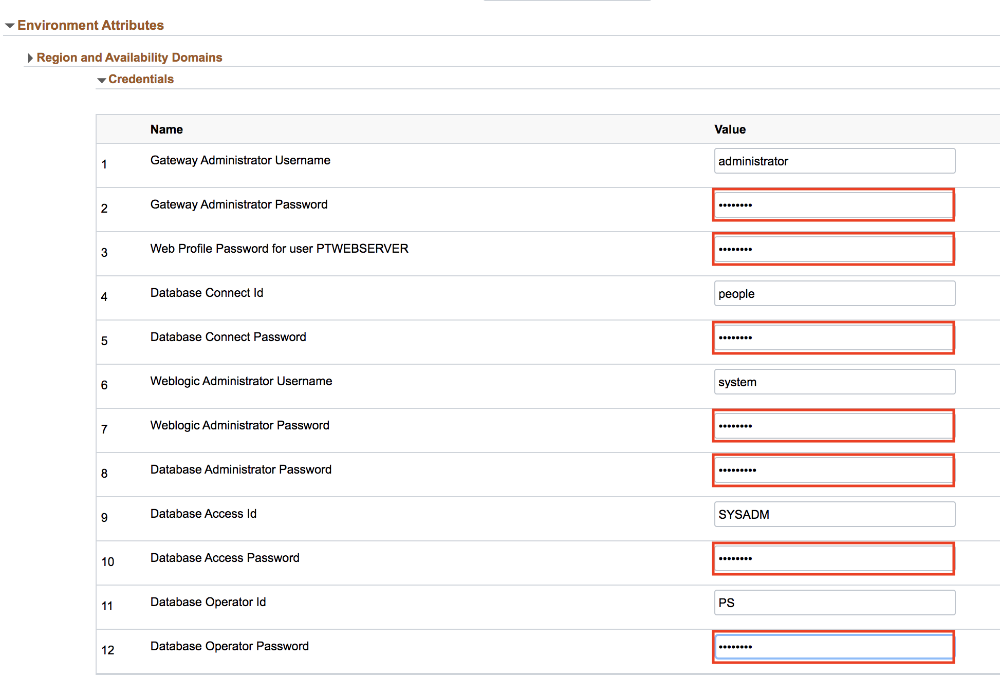

# Lab 800 : Creating Environment in PeopleSoft

## Introduction
Time: 50 mins

## Part 1

1.	Navigate to Dashboard | Environments.  Click Create Environment button.

2.	Provide a unique environment name - **MYPUMENV**. Select the Template that was created in previous section – MYPUM.

3. Expand Environment Attributes -> Region and Availability Domains -> Credentials

Give following values to the field

No. | Full Tier | Credentials
--- | --------- | -----------
1 | Gateway Administrator Password | Psft1234
2 | Web Profile Password for user PTWEBSERVER | Psft1234
3 | Database Connect Password | Psft1234
4 | Weblogic Administrator Password | Psft1234
5 | Database Administrator Password | Psft1234#
6 | Database Access Password | Psft1234
7 | Database Operator Password | Psft1234

Leave the rest as default. You can also expand all sections under Environment Attributes.  

4. Click Done on the top right to begin the environment creation process. 

5. Accept the license. 

6. Refresh the page and click on the arrow button -> Details.

7. Monitor the deployment logs under Dashboard -> Environments -> <Environment> -> Action Menu -> Details -> Logs

8. Once environment creation is completed, you can click on arrow button -> Deploy to start provisioning.

9. Monitor the deployment logs under Dashboard -> Environments -> <Environment> -> Action Menu -> Details -> Logs

