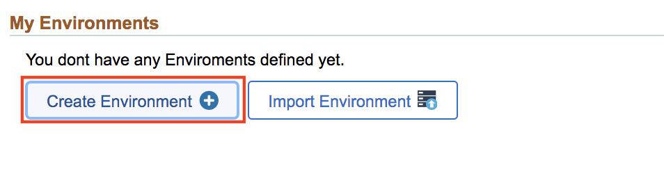
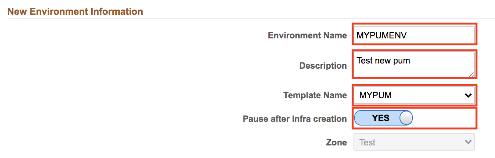
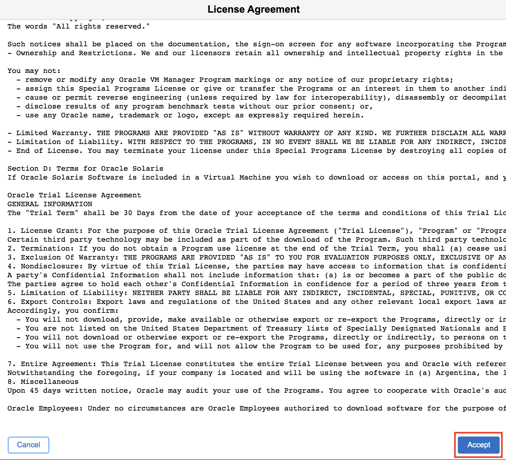
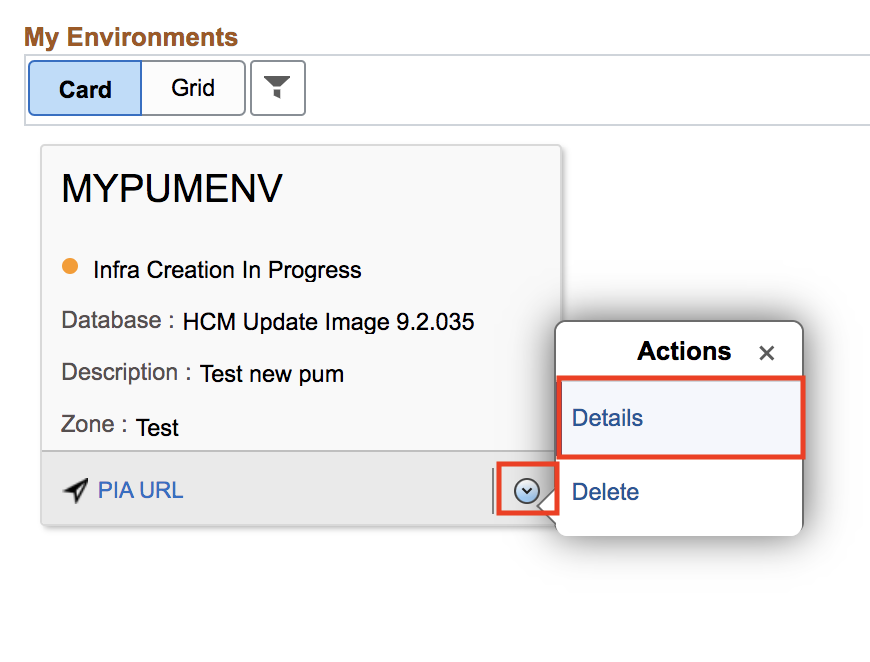
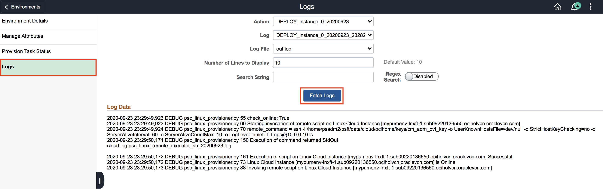
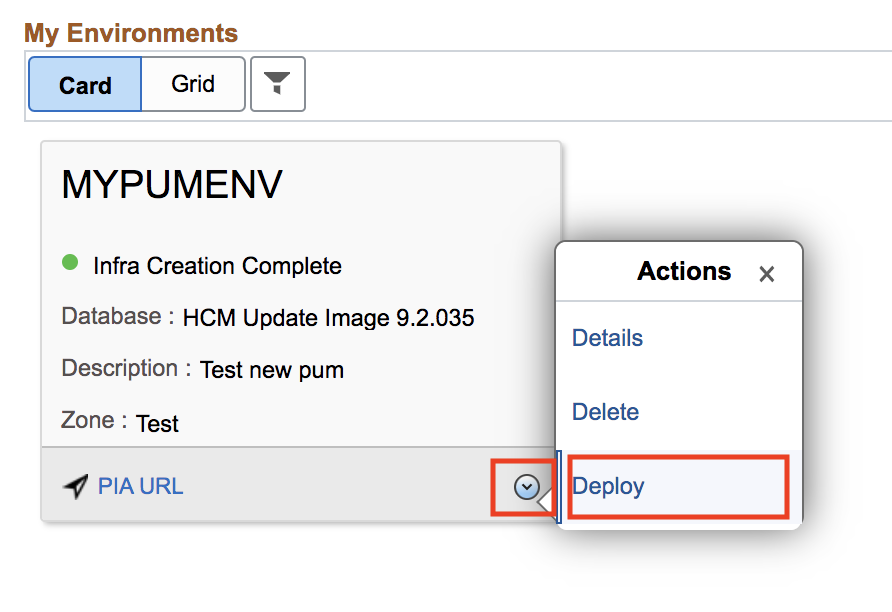

# Lab 800 : Creating Environment in PeopleSoft

## Introduction
Time: 90 mins

## Part 1

1.	Navigate to Dashboard | Environments.  Click Create Environment button.

2.	Provide a unique Environment Name - **MYPUMENV**. Select the Template that was created in previous section – **MYPUM**. Click **yes** for **Pause after infra creation**.  

3. Expand **Environment Attributes -> Region and Availability Domains -> Credentials**

Give following values to the field.

No. | Full Tier | Credentials
--- | --------- | -----------
1 | Gateway Administrator Password | Psft1234
2 | Web Profile Password for user PTWEBSERVER | Psft1234
3 | Database Connect Password | Psft1234
4 | Weblogic Administrator Password | Psft1234
5 | Database Administrator Password | **Psft1234#**
6 | Database Access Password | Psft1234
7 | Database Operator Password | Psft1234

Leave the rest as default. You can also expand all sections under Environment Attributes.  

4. Scroll up and click Done on the top right to begin the environment creation process. 

5. Accept the license. 

6. Refresh the page and click on the arrow button -> Details.

7. Monitor the deployment logs under Dashboard -> Environments -> Environment Name -> Action Menu -> Details -> Logs

You can also go to **Provision Task Status** to see detailed progress status for every step. Click on **Deployment Tasks**. If any step fails, you can change the attribute as per the error and start the process from where it failed.

8. Once environment creation is completed, you can click on arrow button -> Deploy to start provisioning.

9. Monitor the deployment logs under Dashboard -> Environments -> Environment Name -> Action Menu -> Details -> Logs

You can also go to **Provision Task Status** to see detailed progress status for every step. Click on **Deployment Tasks**. If any step fails, you can change the attribute as per the error and start the process from where it failed.

10. After the environment up and running, you can perform a variety of actions on the environment by using the Related Actions button corresponding to each environment. 

The actions can be:

• **Details**: Select this option to view environment details and to perform additional actions on the environment such as performing a health check, applying a PeopleTools patch, viewing logs, and managing PUM connections.

• **Start**: Select this option to start all the instances and then all the domains within them.

• **Stop**: Select this option to stop all domains and shutdown all the instances. In case of database, only compute database instances are shutdown.

• **Delete**: Select this option to remove the environment.

• **Manage Node**: Select this option to scale environment up or down.

• **Clone Environment**: Select this option to clone an existing environment.

• **Refresh**: Select this option to refresh the database or the database, ps app home and ps cust home.  
This option is only available for DBaaS environments.

• **Backup and Restore**: Select this option to backup or restore an environment.
