# Lab : IAM Practice - Identity and Access Management

## Introduction

Oracle Cloud Infrastructure Identity and Access Management (IAM) Service lets you control who has access to your cloud resources. You control the types of access a group of users has and to which specific resources. The purpose of this lab is to give you an overview of the IAM Service components and an example scenario to help you understand how they work together.

## Prerequisites

1.	Oracle Cloud Infrastructure account credentials (User, Password, and Tenant)

2. 	To sign in to the Console, you need the following: 

        1. Tenant, User name and Password
        2. URL for the Console: https://oracle.com
        3. Oracle Cloud Infrastructure supports the latest versions of Google Chrome, Firefox and Internet Explorer 11

## **Step 1:** Signing in to the Console

Console Overview
In this, you sign in to the Oracle Cloud Infrastructure console using your credentials.

1.	Open a supported browser and go to the Console URL: https://oracle.com.

2.	Click on the portrait icon in the top-right section of the browser window, then click on the Sign in to Cloud link.

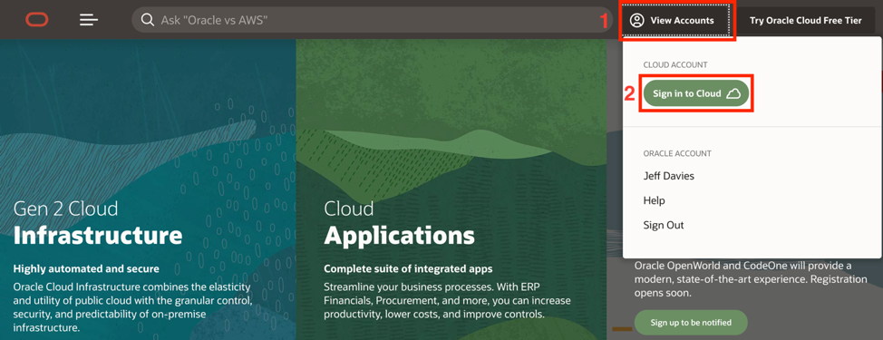

3.	Enter the name of your tenancy (aka your account name, not your user name), then click on the Next button.

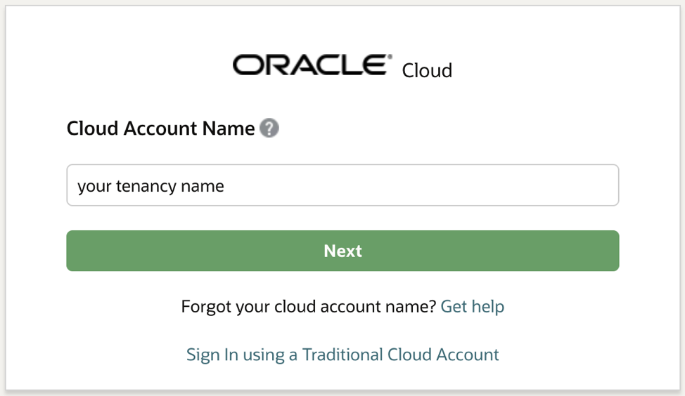

4.	Oracle Cloud Infrastructure is integrated with Identity Cloud Services, you will see a screen validating your Identity Provider. Enter your username and password. Click Sign In.

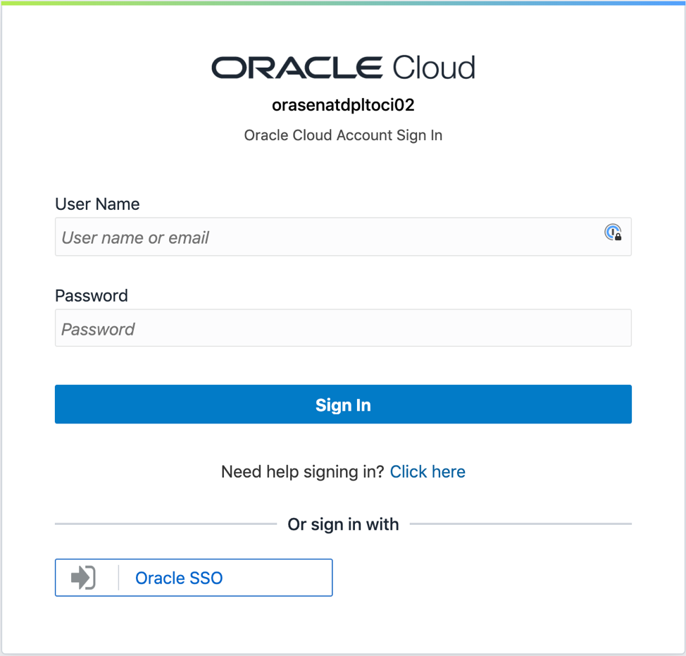

5.	When you sign in to the Console, the dashboard is displayed.

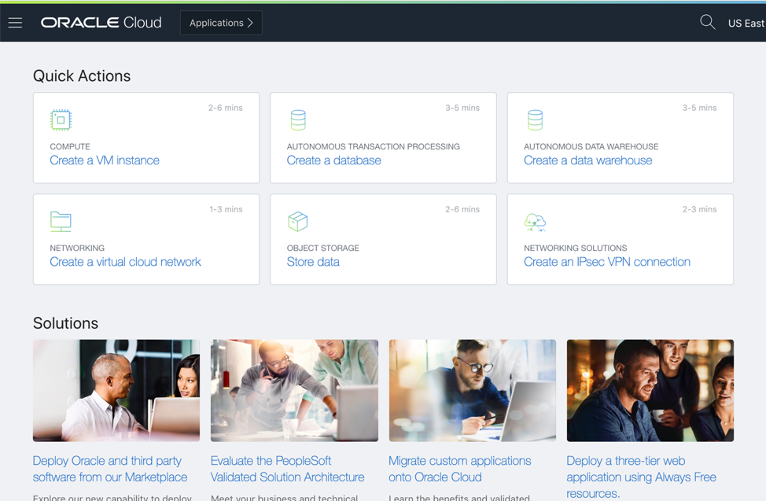

## **Step 2:** Creating Compartments

Compartments Overview:
A compartment is a collection of cloud assets, like compute instances, load balancers, databases, etc. By default, a root compartment was created for you when you created your tenancy (ie when you registered for the trial account). It is possible to create everything in the root compartment, but Oracle recommends that you create sub-compartments to help manage your resources more efficiently.

1.	From the menu, select Identity and Compartments. Click on the blue Create Compartment button to create a sub-compartment.

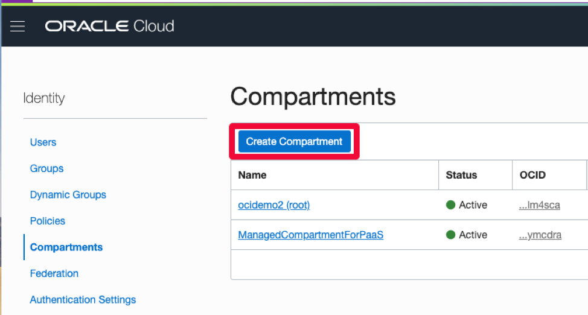

2.	Name the compartment Demo and provide a short description. Be sure your root compartment is shown as the parent compartment. Press the blue Create Compartment button when ready.

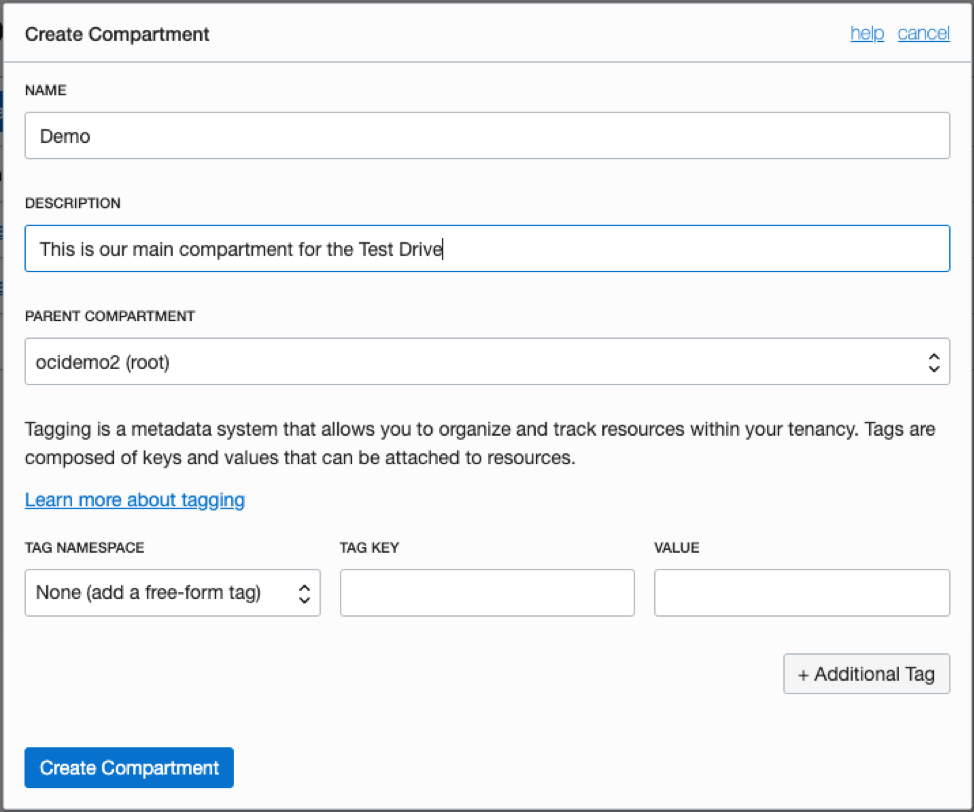

3.	You have just created a compartment for all of your work in this Test Drive.

## **Step 3:** Managing Users, Groups and Policies to Control Access

Security Overview
A user's permissions to access services comes from the groups to which they belong. The permissions for a group are defined by policies. Policies define what actions members of a group can perform, and in which compartments. Users can access services and perform operations based on the policies set for the groups of which they are members.

We'll create a user, a group, and a security policy to understand the concept.

1.	Sign in to the console, on the Menu click Identity, then select Groups.

2.	Click Create Group.

3.	In the Create Group dialog box, enter the following:

        1. Name: Enter a unique name for your group such as "oci-group” Note that the group name cannot contain spaces.
        2. Description: Enter a description (for example, “New group for oci users”).
        3. Click Submit.

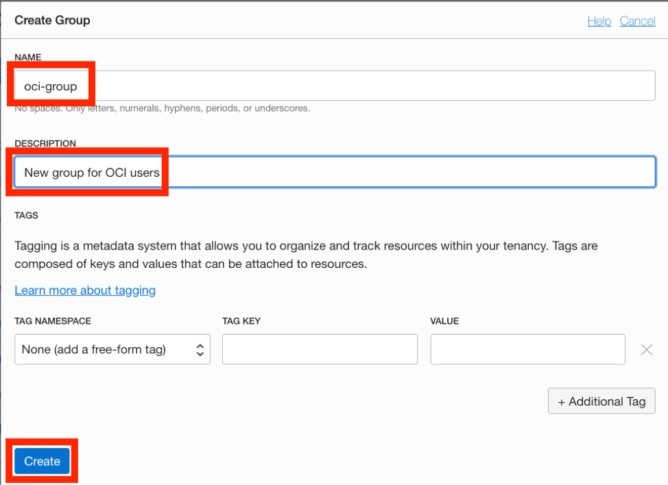

4.	Your new group is displayed.

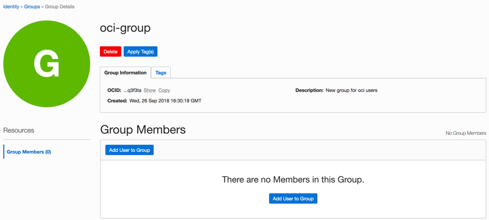

5.	Now, let’s create a security policy that gives your group permissions in your assigned compartment. For example, create a policy that gives permission to compartment Demo to members or group oci-group:

    a) On the Menu click Identity, and then click Policies.

    b) On the left side, select Demo compartment. 

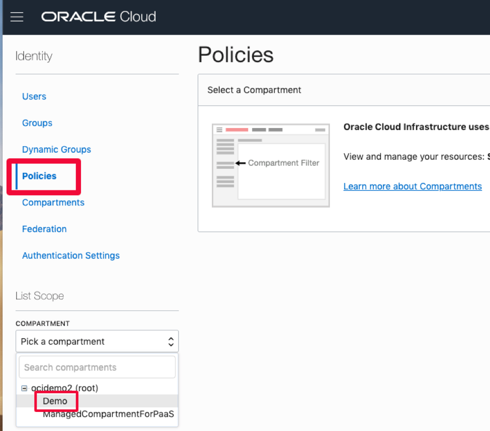

```
NOTE: You may need to click on the + sign next to your main compartment name to be able to see the sub-compartment Demo. If you do, and you still don't see the sub-compartment, Refresh your browser. Sometimes your browser caches the compartment information and does not update its internal cache.
```

    c) After you have selected the Demo compartment, click Create Policy.
    d) Enter a unique Name for your policy (For example, "Policy-for-oci-group") Note that the name can NOT contain spaces.
    e) Enter a Description (for example, "Policy for OCI Group").
    f) Enter the following Statement:
    ```
    Allow group oci-group to manage all-resources in compartment Demo
    ```
    g) Click Create.

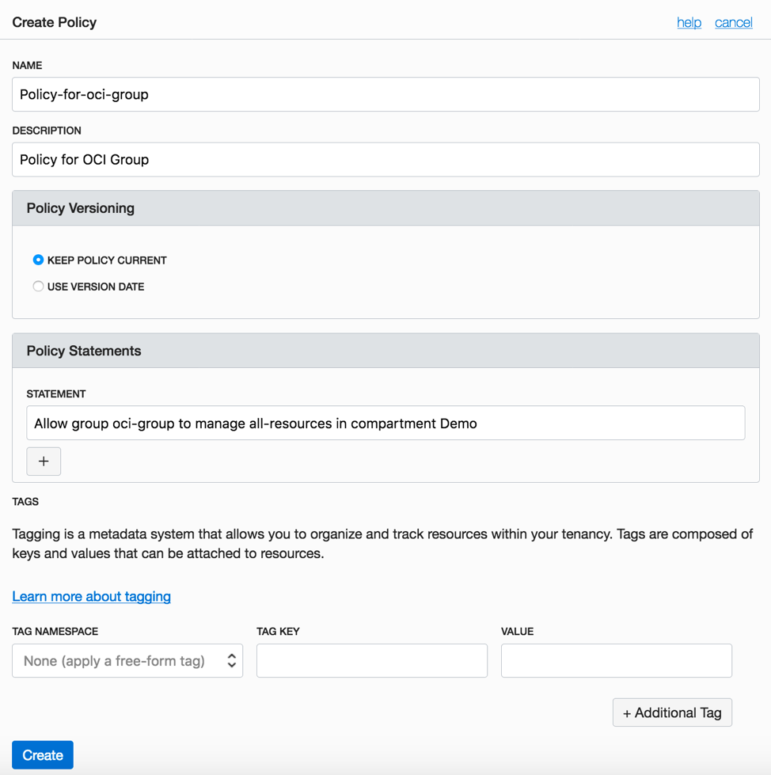


6. Create a New User
   
    a) On the Menu click Identity, and then click Users.

    b) Click Create User.

    c) In the New User dialog box, enter the following:

        **Name:** Enter a unique name or email address for the new user. I recommend using a personal email address to which you have access (GMail, Yahoo, etc). This value is the user's login name for the Console and it must be unique across all other users in your tenancy.
        **Description:** Enter a description. For example, New oci user.

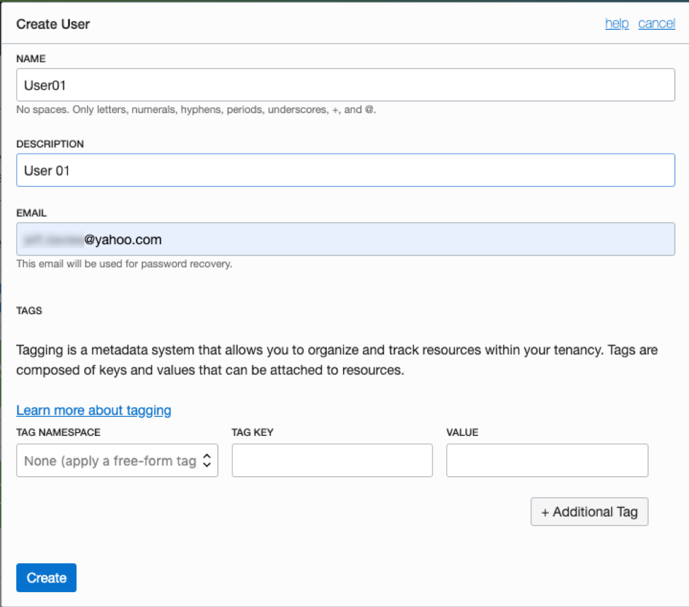

    d) Click Create.


7.	Set a Temporary Password for the newly created User

    a) From the list of users, click on the user that you created to display its details.
    b) Click Create/Reset Password.

    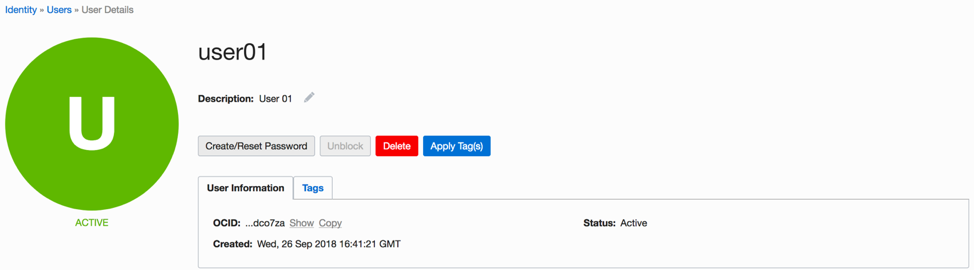

    c) In the dialog, click Create/Reset Password.

    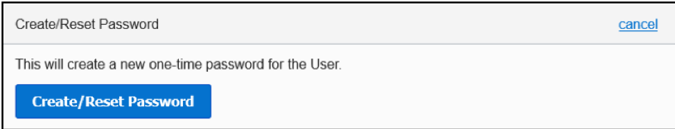

    d) The new one-time password is displayed.

    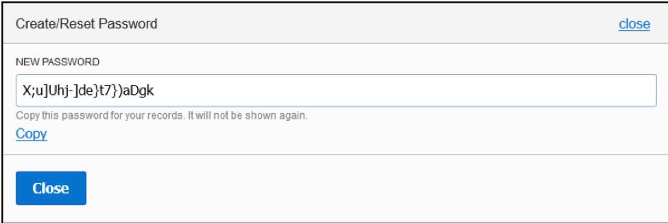

    e) Click the Copy link and then click Close. Make sure to copy this password to your notepad.

    f) Click Sign Out from the user menu and log out of the admin user account completely.

    


8.	Sign in as the new user using a different web browser or an incognito window.

    a) Go to https://oracle.com.

    b) Enter the Tenant name, if prompted.

    c) This time, you will sign in using local credentials box with the user you created. Note that the user you created is not part of the Identity Cloud Services.

    d) Enter the password that you copied.

    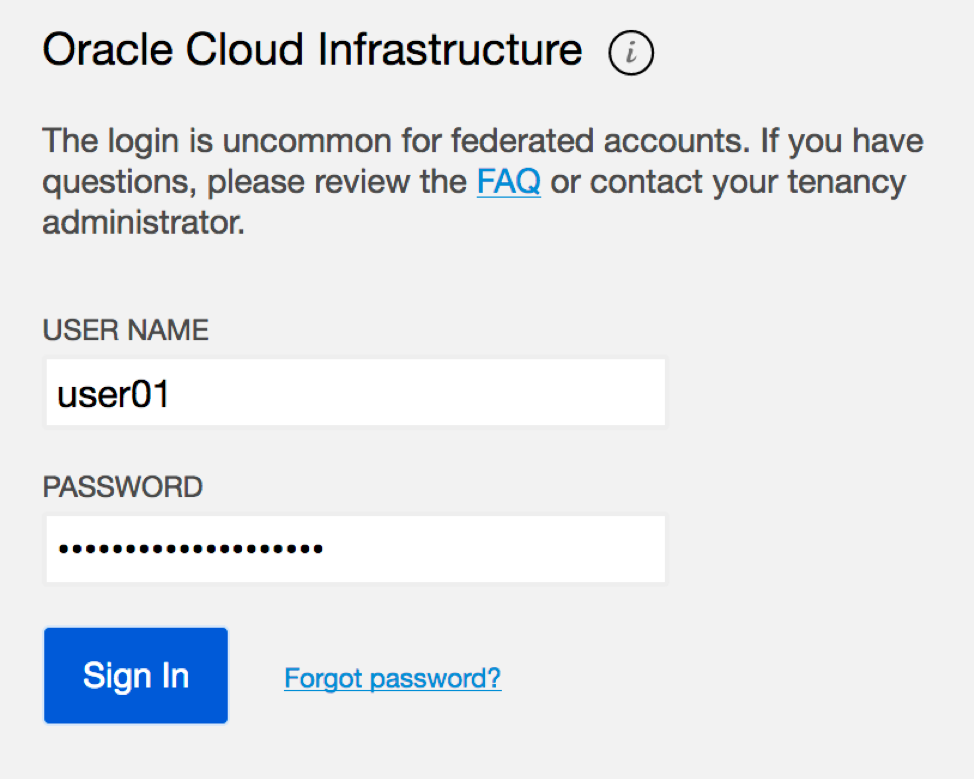

    ```
    Note: Since this is the first-time sign-in, the user will be prompted to change the temporary password, as shown in the screen capture.
    ```

    e) Set the new password to Welc0me2*bmcs. Click Save New Password. 

    


9.	Verify user permissions

    a) Go to the Menu click Compute and Instances.

    b) Try to select any compartment from the left menu.

    c) The message “You don’t have access to this compartment” appears. This is normal as you did not add the user to the group where you associated the policy. 

    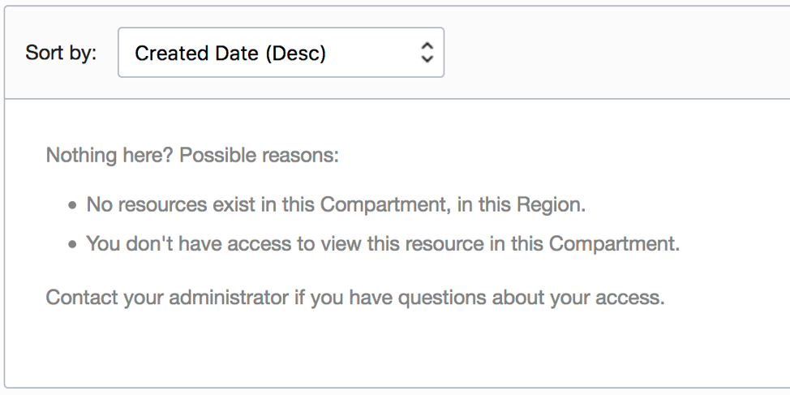

    d) Sign out of the Console.


10.	Add User to a Group

    a) Sign in back with the admin account. 
    
    b) From the Users list, click the user account that you just created (for example, user01) to go to the user details page.

    c) Under the Resources menu on the left, click Groups.

    d) Click Add User to Group.

    e) From the GROUPS drop-down list, select the oci-group that you created.

    f) Click Add. 

    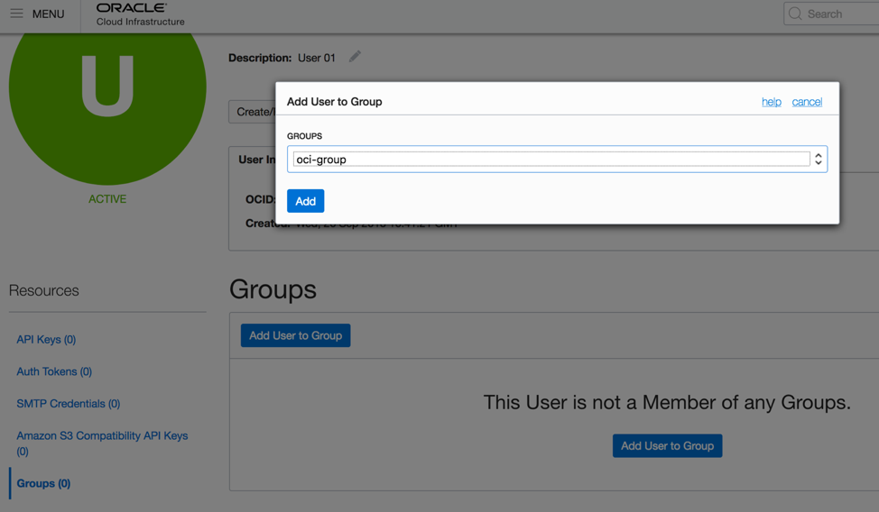

    g) Sign out of the Oracle Cloud website.


11.	Verify user permissions when a user belongs to a specific group

    a) Sign in with the local user01 account you created. Remember to use the latest password you assigned to this user.

    b) Go to the Menu click Compute and Instances.

    c) Select compartment Demo from the list of compartments on the left.

    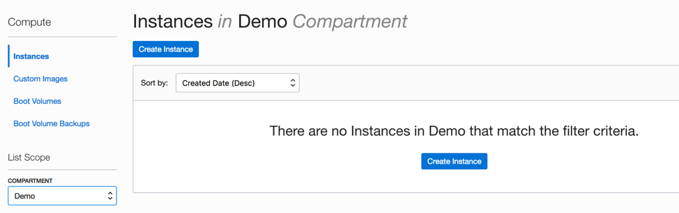

    d) There is no message related to permissions and you are allowed to create new instances

    e) Go to the Menu click Identity and select Groups.

    f) The message “You don’t have access to these resources” appears. This is expected, since your user has no permission to modify groups. (Note: You may instead get the "An unexpected error occurred" message instead. That is also fine.)

    g) Sign out.


## **Step 4:** Creating a VCN

1.	On the Oracle Cloud Infrastructure Console Home page, under the Quick Actions header, click on Set up a network with a wizard.


2.	Select VCN with Internet Connectivity, and then click Start Workflow.


3.	Complete the following fields:

Field |	Vaue
----- | ----
VCN NAME |	OCI_HOL_VCN
COMPARTMENT	| Choose the Demo compartment you created in the Identity Lab
VCN CIDR BLOCK |	10.0.0.0/16
PUBLIC SUNBET CIDR BLOCK |	10.0.2.0/24
PRIVATE SUBNET CIDR BLOCK |	10.0.1.0/24
USE DNS HOSTNAMES IN THIS VCN |	Checked

4.	Your screen should look similar to the following:

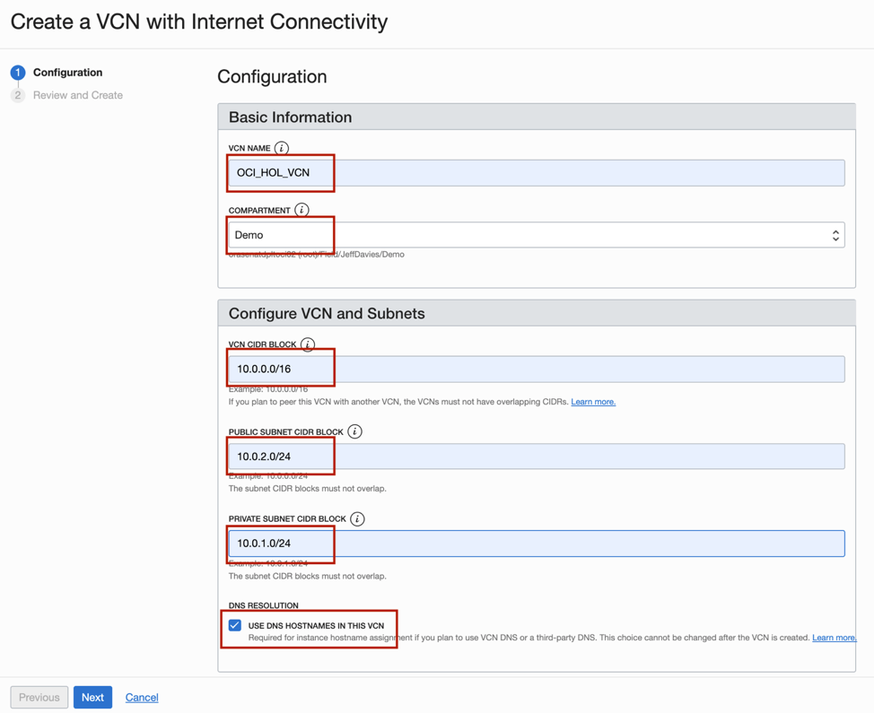

5.	Press the Next button at the bottom of the screen.

6.	Review your settings to be sure they are correct. 

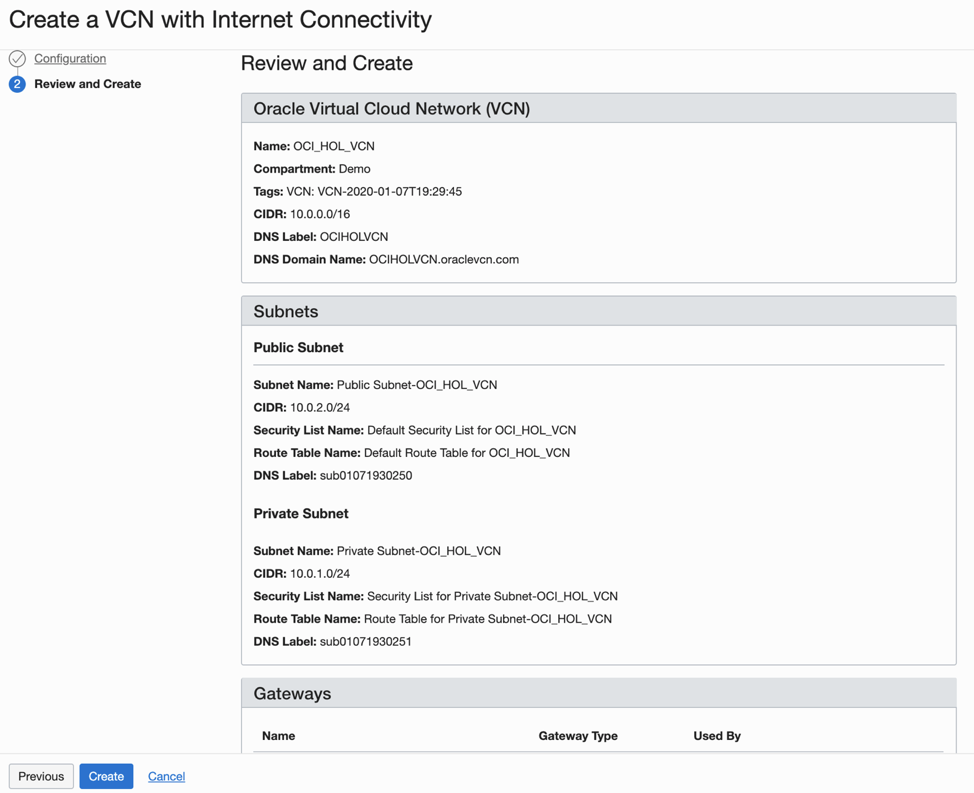

7.	Press the Create button to create the VCN. I will take a moment to create the VCN and a progress screen will keep you apprised of the workflow.

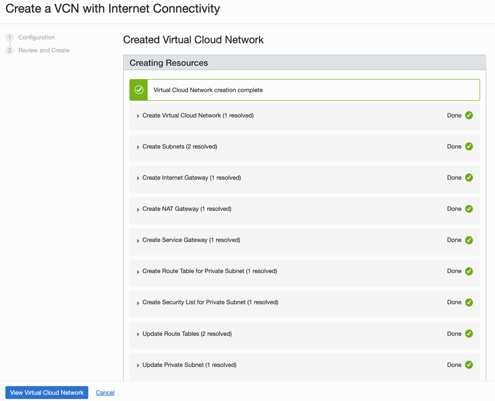

8.	Once you see that the creation is complete (see previous screenshot), click on the View Virtual Cloud Network button.

### Summary
This VCN will contain all of the other assets that you will create during this set of labs. In real-world situations, you would create multiple VCNs based on their need for access (which ports to open) and who can access them


## **Step 5:** Creating a new subnet

1.	Navigate to Menu -> Networking -> Virtual Cloud Networks.  Set the Compartment to ‘PSFT_Lab’.  Click on the existing VCN "OCI_HOL_VCN". 


2.	Click on Create Subnet button to add a new subnet. Use default route table, and default DHCP options. Use 10.0.8.0/24 as the CIDR for subnet. 

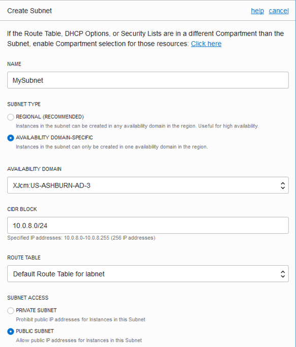

Attribute | Value
--------- | -----
Name|	MySubnet
Subnet Type	| Availability Domain-specific
Availability Domain	| AD 3
CIDR Block| 	10.0.8.0/24
Route Table	 | Default Route Table for labnet
Subnet Access| 	Public Subnet
DNS Resolution|	Enable Use DNS hostnames in this SUBNET
Security List	|Add two security lists using the button + Additional Security List as shown in below screenshot - 1. cm_sec 2. Default Security List for labnet


3.	Click Create Subnet.  The newly created subnet will be as shown 


## **Step 6:** Create Windows Instance

In this lab exercise, Windows node was removed from the topology to keep the provisioning process short and simple.  If you want to provision Windows instances as part of an environment at a later point in time, you can do so easily. 


