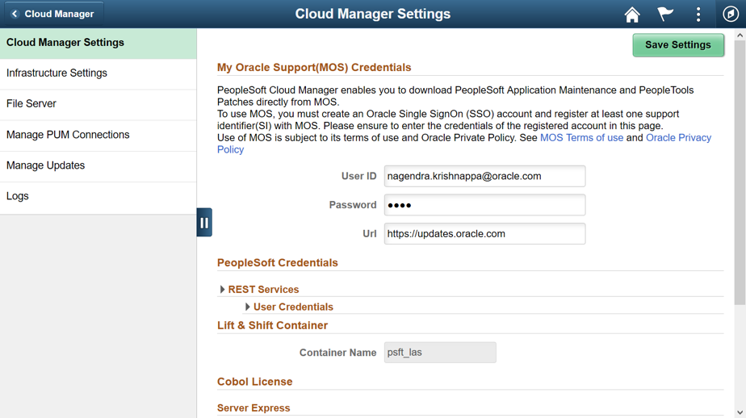
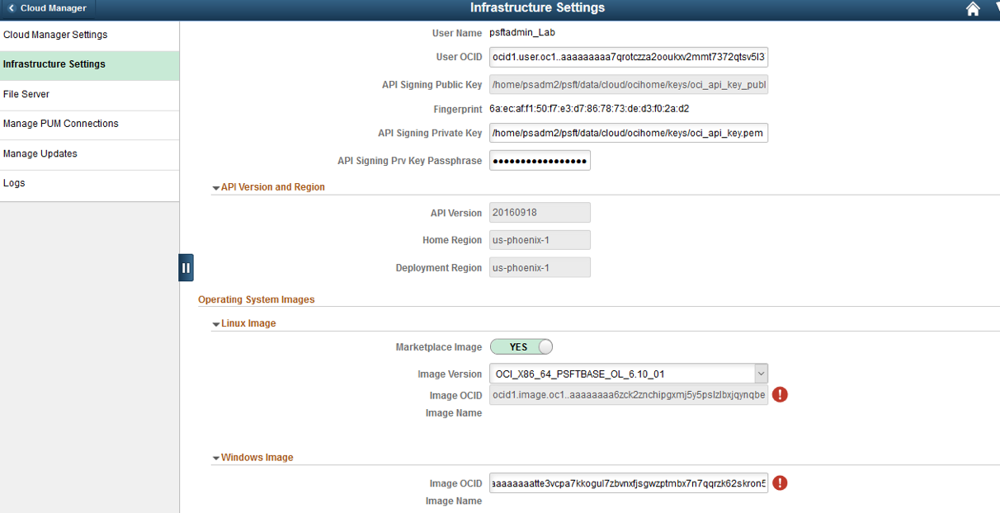
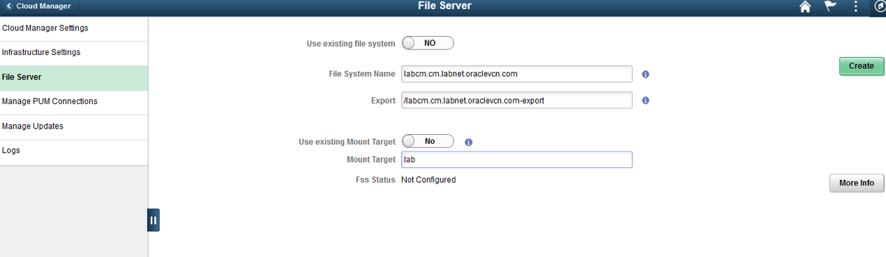

# Lab 300 : Configure Cloud Manager Settings

## Introduction
This lab will guide you how to configure the settings on Cloud Manager

Time: 20 min

## Part 1. Configuring settings

1.	Navigate to Cloud Manager Dashboard -> Cloud Manager Settings -> Cloud Manager Settings.

2.	Update My Oracle Support (MOS) Credentials.  This is required to download DPKs and PRPs automatically. 

3.	Navigate to Infrastructure Settings and update Operating System Images. For Linux, enable “Marketplace Image” radio button and choose the latest version from the displayed list.

For Windows image, use the value of “Windows_/2016_Platform_Image_for_CM” displayed earlier in the Outputs section of the stack.
 

4.	Click ‘Save’ to save the configuration. 

5.	Click ‘Refresh OCI Metadata’ button on top of the page and wait for few minutes.

6.	Next, navigate to File Server tab.  Accept the defaults.   For Mount Target, type “lab”.

7.	Click Create.  This action will create a file server in a few minutes. 

8.	Wait until the file server status shows ‘FSS Configured’, and then the system is ready for downloads. 

