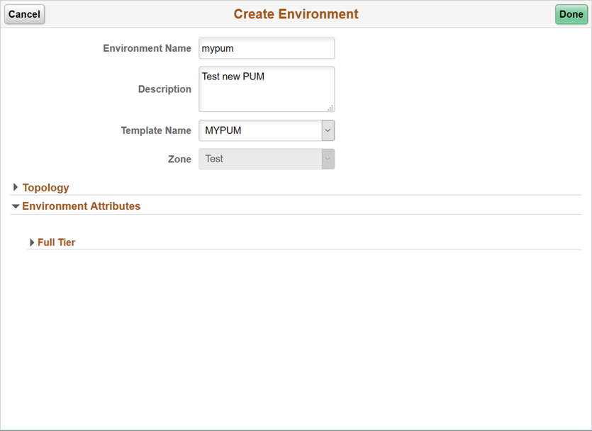

# Lab 700 : Creating Environment in PeopleSoft

## Introduction
Time: 50 mins

## Part 1

1.	Navigate to Dashboard | Environments.  Click Create Environment button. 

2.	Provide a unique environment name. Select the Template that was created in previous section – MYPUM.
Expand all sections under Environment Attributes and provide all inputs.  
Use the table given below for quick and default values. Click Done to begin the environment provisioning process. 
Monitor the deployment logs under Dashboard -> Environments -> <Environment> -> Action Menu -> Details -> Logs

No. | Full Tier | Credentials
--- | --------- | -----------
1 | Database Connect Id | people
2 | Database Connect Password | Password1234
3 | Weblogic Administrator Username | system
4 | Weblogic Administrator Password | Password1234
5 | Database Administrator Password | Password1234
6 | Gateway Administrator Username | administrator
7 | Gateway Administrator Password | Password1234
8 | Database Operator Id | PS
9 | Database Operator Password | PS
10 | Web Profile Password for user PTWEBSERVER | Password1234
11 | Database Access Id | SYSADM
12 | Database Access Password | Password1234

No. | Full Tier | General Settings
--- | --------- | ----------------
1|	PeopleSoft Deployment Path |	/u01/app/oracle/product
2|	Database Access Id 	|SYSADM
3|	Database Connect Id |	people
4|	Enable EM agent |	No
5|	Weblogic Administrator Username |	system
6|	Database Name |	MYPUM
7|	Gateway Administrator Username |	administrator
8|	Database Operator Id | 	PS
9|	Database Server Port |	1522
10|	Database Type |	SYS
11|	Enable Multi Language |	NO
12|	Pre Provision Custom Script |	-
13|	Post Provision Custom Script |	-

Full Tier | Domain Settings | Web Server Settings
--------- | --------------- | -------------------
1|	Number of Domains |	1
2|	Authentication Domain |	default
3|	HTTP PIA Port |	8000
4|	HTTPS PIA Port |	8443

Full Tier | Domain Settings | Appserver Settings
--------- | --------------- | ------------------
1|	Number of Domains |	1
2|	Number of App Server Instance (PSAPPSRV services) Per Domain 	|2
3|	Number of Query Server Instances(PSQRYSRV services) Per Domain 	|1
4|	Number of SQL Access App Server(PSSAMSRV services) Per Domain 	|1
5|	Number of Jolt Listener(Jolt Handler) Per Domain 	|3
6|	Jolt Port |	9033
7|	WSL Port  | 7000
8|	Enable IB settings on first domain |	YES
9|	Number of App Server instance(PSAPPSRV services) for IB |	2
10|	Number of SQL Access App Server(PSSAMSRV services) for IB |	1
11|	Number of PSBRKHND instances for IB  | 1
12|	Number of PSSUBHND instances for IB  | 1
13|	Number of PSPUBHND instances for IB |	1

Full Tier | Domain Settings | Process Scheduler Settings
--------- | --------------- | --------------------------
1|	Number of Domains |	1
2|	Number of App Engine Server Instances(PSAESRV services) Per Domain 	|2
3|	Number of App Engine Server Instances(PSDSTSRV services) Per Domain |	2

 
Full Tier | Domain Settings | Process Scheduler Server Definition Parameters
--------- | --------------- | ----------------------------------------------
1	| Application Engine 	|1
2	| XML Publisher 	|1
3	 | COBOL SQL 	|1
4	 | Optimization Engine| 	1
5	|SQR Process 	|1
6	|SQR Report 	|1
7	| Max Api Aware |	1

Full Tier | Domain Settings | Advanced
--------- | --------------- | --------
None | | 

